## 6.2 网络审批

> *__该服务在界面上对普通用户可隐藏__*

#### 1. 核心概念

详见[3.2 网络服务](../UOS项目平台/网络服务.md)

#### 2. 相关操作

目前审批系统对网络的操作支持如下：

* __申请私有网络__    

> *与项目平台相比，不可直接创建，需要申请。*

单击二级导航栏“网络”->在“网络”页面单击“申请私有网络”->在弹出框的文本框中输入私有网络的名称，可以选择“Vlan网络”、“开启安全限制（设置后不能更改）”和“申请子网”前的复选框。若选择“申请子网”，则在“子网”的文本框中给出子网的名称，在“网络地址”的文本框中填写子网的网络地址->填写申请说明->单击“申请”按钮即可申请私有网络。如图:
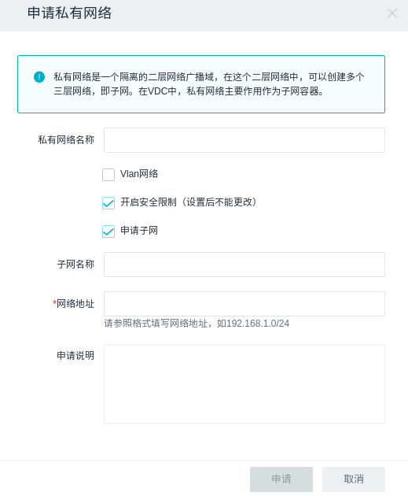 

* __申请子网__    

> *与项目平台相比，不可直接创建，需要申请。*

单击二级导航栏“网络”，单击“子网”标签，单击“申请子网”按钮->在弹出框中的“子网名称”文本框中输入子网的名称。单击“选择私有网络”，在下拉框中选择需要创建子网的私有网络，在“网络地址”的文本框中填写子网的网络地址。若需要使用到子网的高级设置，选中“显示高级选项”前的复选框。若选择“开启网关”，可以在“网关地址栏”文本框中输入网关地址，如不填，系统将自动生成。这个地址可以被用于该私有网络内其他主机的缺省网关。选择“开启DHCP服务”前的复选框，在“DNSx”文本框中输入解析名称，即可推送云主机的name server。确认信息后单击“申请”按钮，在弹出框中填写申请说明，即可完成申请。如图:

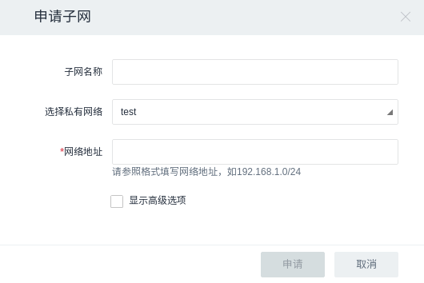 

* __申请公网IP__

> *与项目平台相比，不可直接创建，需要申请。*

单击二级导航栏“公网IP”->单击“申请公网IP”按钮，在弹出框中填写申请说明->单击“申请”按钮即可快速申请一个公网IP。如图:

 

* __解绑公网IP__    

> *功能与项目平台一致*

单击二级导航栏“公网IP”->选中“IP地址”前的复选框，单击“更多”按钮，点击“解绑”，在弹出框中单击“解绑”按钮即可将公网IP从云主机或负载均衡上解绑。如图:

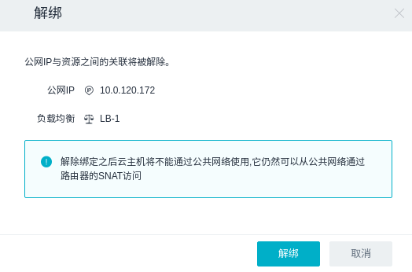 

* __（公网IP）绑定到云主机__    

> *功能与项目平台一致*

单击二级导航栏“公网IP”->选中未使用的“IP地址”前的复选框，单击“绑定到云主机”按钮，在弹出框中单击“云主机”，在下拉框中选择云主机（没有网络端口的云主机不会显示在列表中），单击“网络端口”，在下拉框中选择云主机的网络端口->单击“绑定”按钮即可将公网IP绑定到云主机。如图:

 

* __（公网IP）绑定到负载均衡__    

> *功能与项目平台一致*

单击二级导航栏“公网IP”->选中未使用的“IP地址”前的复选框，单击“更多”按钮，点击“绑定到负载均衡”，在弹出框中单击“负载均衡”，在下拉框中选择负载均衡，单击“网络端口”，在下拉框中选择负载均衡的网络端口->单击“绑定”按钮即可将公网IP绑定到负载均衡。如图:

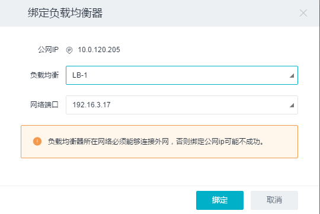

* __申请路由器__    

> *与项目平台相比，不可直接创建，需要申请。*

单击二级导航栏“路由器”->单击“申请路由器”按钮，在弹出框中的“名称”文本框中输入路由器名称和申请说明，即可快速申请一个路由器。可以选中“开启公网网关”前的复选框开启公网网关，允许私有网络内部与外部公网网络之间通信，否则不可通信。如图:

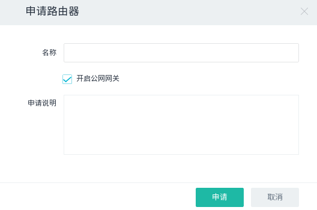 

* __申请网络端口__    

> *与项目平台相比，不可直接创建，需要申请。*

单击二级导航栏“网络端口”->单击“申请网络端口”按钮，在弹出框中的“名称”文本框中输入网络端口名称。单击“子网”，在下拉列表中选择网络端口所在的子网，“IP地址”文本框可以选择输入或不输入。若不输入则系统会自动分配。选择“安全组”中合适的安全组规则->输入申请说明->单击“申请”按钮即可申请一个网络端口。如图:

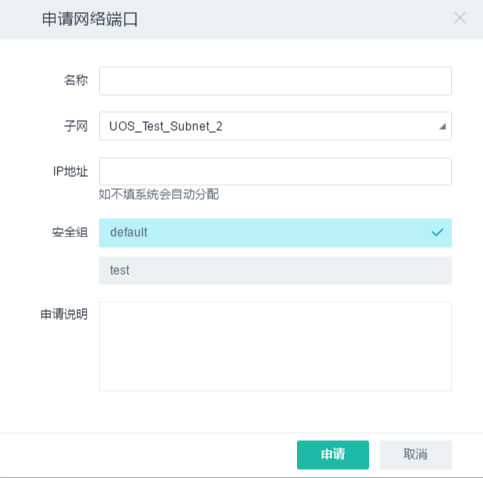 

* __（网络端口）绑定到云主机__    

> *功能与项目平台一致*

单击二级导航栏“网络端口”->选中新建的未使用的网络端口名称前的复选框，单击“绑定到云主机”->单击弹出框中的“云主机”，在下拉列表中选择云主机->单击“绑定”按钮即可给云主机添加网络端口。如图:

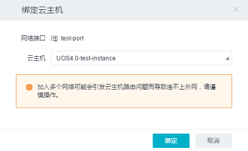 

* __（网络端口）从云主机卸载__    

> *功能与项目平台一致*

单击二级导航栏“网络端口”->选中关联资源为云主机的网络端口名称前的复选框，单击“从云主机卸载”，在弹出框中单击“卸载”按钮即可删除云主机的网络端口。如图:

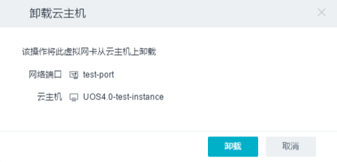 

* __申请安全组__     

> *与项目平台相比，不可直接创建，需要申请。*

单击二级导航栏“安全组”->单击“申请安全组”按钮，在弹出框中的“名称”文本框中输入安全组名称，可以选择在“描述”文本框中输入对安全组的描述，也可不输入-->输入申请说明->单击“申请”按钮即可申请一个新的安全组。如图:

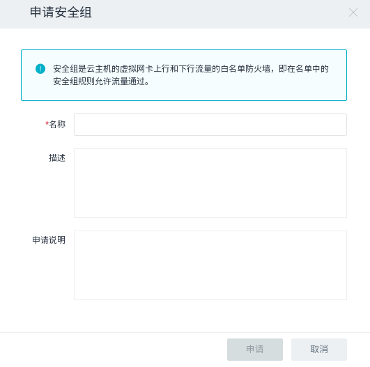 

* __申请添加（上行/下行）安全组规则__    

> *与项目平台相比，不可直接创建，需要申请。*

单击二级导航栏“安全组”-> 单击新创建的安全组名称->在“详细信息”页面中看到“下行/上行”和“申请添加规则”按钮。如需添加下行组规则，单击“下行”按钮 ->单击“申请添加规则”按钮，在弹出框中选择“规则”、“协议”以及“目标”，单击“申请”按钮即可申请添加下行安全组规则。如需申请添加上行安全组规则，同下行规则一样即可申请添加上行安全组规则。如图:

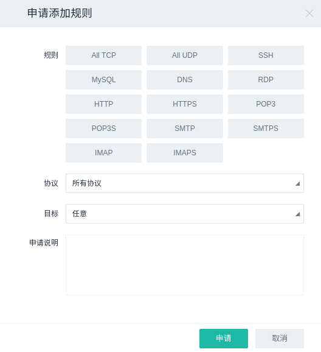 

*__备注__*：

> * **下行安全组规则**是指从外部（公网或者其他云主机）访问云主机的白名单规则，即只允许满足以下规则的流量通过。默认不允许任何协议的流量通过。
>* **上行安全组规则**是指从云主机内部访问外部（公网或者其他云主机）的白名单规则，即只允许满足以下规则的流量通过。默认允许所有协议流量通过。
>* **为了能够实现云主机的远程SSH登录**，我们需要创建安全组的下行规则（从外部访问云主机）。由于默认的下行安全组规则不允许任何流量通过，故需要手动创建满足SSH登陆的条件。SSH是一种网络协议，用于计算机之间的加密登陆。**SSH的默认端口是22，也就是说，从远程登录时的登录请求会送到远程主机的22端口。点击安全组后，选择下行的“添加安全组规则”，规则选择HTTP，协议为TCP协议，端口范围为22，目标选择任意即可实现符合SSH登录的端口条件**。

* __申请负载均衡器__

> *与项目平台相比，不可直接创建，需要申请。*

  单击二级导航栏“负载均衡”->单击“申请负载均衡器”按钮，在弹出框中填写名称，单击子网，在下拉框中选择子网，填写描述和申请说明，单击“申请”按钮即可完成申请。如图:
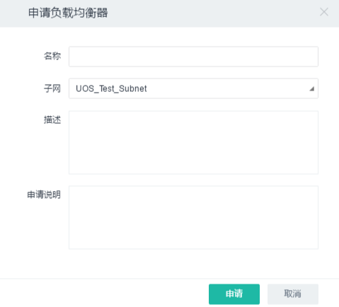

  默认的负载均衡器没有绑定公网IP，选定负载均衡器后，选择“更多”->“绑定公网IP”即可。

* __（负载均衡）申请监听器__

> *与项目平台相比，不可直接创建，需要申请。*

  创建负载均衡器完成了绑定公网IP的工作，需配置负载均衡器的监听器，以描述会将怎样的访问请求转给业务服务器。选中一个负载均衡器，选择监听器标签页，即可申请监听器。单击“申请监听器”按钮，我们需要指定监听器的名称、协议类型、端口号和最大连接数，不同的连接数将对应不同的消费金额。确认信息后，点击“申请”按钮即可完成申请。如图:

 

* __（负载均衡）申请资源池__

> *与项目平台相比，不可直接创建，需要申请。*

  在“负载均衡”右侧，我们可以看到“资源池”的标签页，进入“资源池”标签页->单击“申请资源池”按钮->填写资源池名称、协议、监听器、负载方式、描述和申请说明。确认信息填写正确后，单击“申请”按钮即可完成申请。如图:

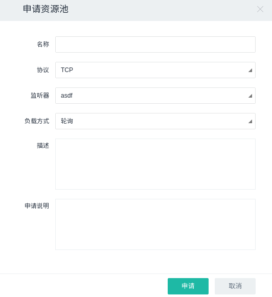 

* __（资源池）申请健康检查__

> *与项目平台相比，不可直接创建，需要申请。*

  为了保证云主机上业务的可用性，我们通常会设置相关的健康检查机制来确保服务器处于一直可用的状态。我们通过设置负载均衡服务监听的时间间隔，超时限制以及尝试连接的次数来保证服务的正常运行。

  在“负载均衡”右侧，我们可以看到“资源池”的标签页，进入“资源池”标签页->单击“申请健康检查”按钮->选择和填写资源池、探针类型、间隔时间、超时限制、尝试次数、申请说明。确认信息填写正确后，单击“申请”按钮即可完成申请。如图:
  
 
