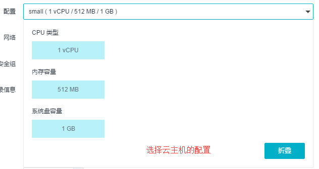
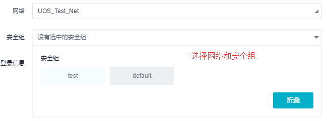
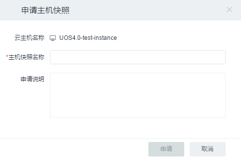
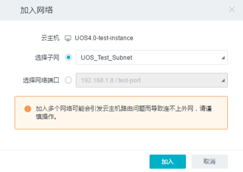
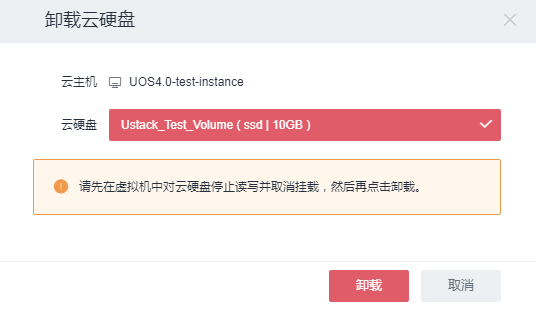

## 6.1 计算审批

### 6.1.1 云主机审批

#### 1. 核心概念

请查看[3.1.1 云主机服务](../UOS项目平台/计算服务.md#311-云主机服务)中的相关概念。

#### 2. 相关操作

目前审批系统对主机的操作支持如下：

> *__与项目平台相比，审批系统的云主机服务少了更改密码功能，增加了“一键创建”功能以及更改拥有人和更改用途功能。__*

* __一键创建__

单击二级导航栏“创建云主机”，在页面中填写相关信息：云主机名称，选择镜像，选择合适的配置（包括CPU类型、内存容量和系统盘容量），选择网络和安全组，选择登录信息（只能密码登录），选择是否勾选“创建公网IP并绑定”（**上方选择的网络中有子网连接了路由器此项才会显示**）和“创建云硬盘并挂载”（若勾选则需额外输入云硬盘名称以及容量），单击“创建申请”即可，如图：

* __申请云主机__      

单击二级导航栏“云主机”，单击“申请云主机” ->在页面中的文本框输入主机名称，并选择镜像，如图：    

     

单击“下一步”，单击“配置”，在下拉框中选择CPU类型、内存容量和硬盘容量，单击“折叠”按钮，如图：    

单击“网络”，在下拉框中选择一个私有网络->单击“安全组”，选择一个安全组，单击“折叠”按钮，如图：  
  

若使用密钥对登录，单击“密钥对”，选择所需的密钥；若使用密码登录，单击“密码”，在文本框中输入密码（密码要求必须以数字或字母开头，同时包含大写字母、小写字母、数字，并且长度在8－20位字符之间。）以及确认密码，如图：    

*__备注__：*
> *目前登录信息只有密码登录。*    

设置创建的云主机的数量（不得小于1）->单击“下一步”按钮。填写使用用途（用途的描述不得多于85个字）和申请说明，单击“创建”按钮即可完成申请。如图：       

* __开机/关机/重启/删除__    

> *功能跟项目平台一致。*

单击二级导航栏“云主机”，页面上会呈现“开机”和“关机”按钮。若云主机处于开机状态，只需选中云主机名称前的复选框，单击“关机”按钮即可将云主机关机。若云主机处于关机状态，只需选中云主机名称前的复选框，单击“开机”按钮即可将云主机开机。若想重启云主机，选中云主机名称前的复选框，单击“更多”按钮->在下拉菜单中单击“重启”按钮即可实现云主机的重启工作。如图：    

* __VNC登录__     

> *功能跟项目平台一致。*

单击二级导航栏“云主机”->选中云主机名称前的复选框，单击“VNC登录”即可快速管理云主机；或者选中一个云主机弹出详细信息页，点击“VNC登录”。如图：    

* __申请更改配置__    

> *与项目平台相比，审批系统将直接更改改为了申请。* 

单击二级导航栏“云主机”，选中云主机名称前的复选框，单击“更多”按钮->单击“申请更改配置”，在弹出框中修改需要更改的配置，包括CPU类型、内存容量和云硬盘容量。->单击“申请”按钮，填写“申请说明”，即可完成申请。如图：    

* __申请主机快照__    

> *与项目平台相比，审批系统将直接创建改为了申请。* 

单击二级导航栏“云主机”，选中云主机名称前的复选框，单击“更多”按钮->单击“申请主机快照”，在弹出框中输入主机快照的名称，填写申请说明->单击“申请”按钮，即可完成申请。如图：    

* __更改拥有人__

单击二级导航栏“云主机”，选中云主机名称前的复选框，单击“更多”按钮->单击“更改拥有人”，在弹出框中输入更改的拥有人名称->单击“确认”按钮，即可完成更改。如图：

* __更改用途__

单击二级导航栏“云主机”，选中云主机名称前的复选框，单击“更多”按钮->单击“更改用途”，在弹出框中输入更改用途->单击“确认”按钮，即可完成更改。如图：

* __绑定/解绑公网IP__   

> *功能跟项目平台一致。*

单击二级导航栏“云主机”，选中云主机名称前的复选框，单击“更多”按钮->若云主机未绑定公网IP，单击“绑定公网IP”，在弹出框中点击“公网IP”，在下拉框中选择公网IP->单击“绑定”按钮即可给云主机绑定公网IP。若云主机已绑定公网IP，单击“解绑公网IP”，在弹出框中单击“解绑”按钮即可解绑公网IP。如图：    

* __加入网络__   

> *功能跟项目平台一致。*

单击二级导航栏“云主机”，选中云主机名称前的复选框，单击“更多”按钮->单击“加入网络”，在弹出框中单击“选择子网”（或“选择网络端口”），在下拉框中选择需要加入的网络（或网络端口）->单击“加入”按钮即可实现云主机加入网络。如图：    

* __修改安全组__    

> *功能跟项目平台一致。*

单击二级导航栏“云主机”，选中云主机名称前的复选框，单击“更多”按钮->单击“修改安全组”，在弹出框中单击“网络端口”，在下拉框中选择需要修改的网络端口。选择安全组类型->单击“保存”按钮即可修改云主机的安全组规则。如图：    

* __挂载云硬盘__    

> *功能跟项目平台一致。*

单击二级导航栏“云主机”，选中云主机名称前的复选框，单击“更多”按钮->单击“挂载云硬盘”，在弹出框中选择云硬盘类型，选中需要挂载的云硬盘->单击“挂载”按钮即可将云硬盘挂载到云主机。如图：    

* __卸载云硬盘__    

> *功能跟项目平台一致。*

如图：    

详见[3.1.5存储服务](../UOS项目平台/云主机服务.md#315-存储服务)。

* __创建报警__ 

单击二级导航栏“云主机”->选中一个云主机弹出详细信息页->点击“监控”标签，列有该云主机的**CPU使用率、内存使用率、磁盘读速率、磁盘写速率、网络端口传入平均速率和网络端口传出平均速率**的图表，单击“创建报警”按钮->在弹出框中填写相关信息（具体创建过程详见[3.4.1 报警](../UOS项目平台/监控报警服务.md#3.4.1 报警)），即可创建该云主机的一个报警，在“报警”标签列出了报警列表。

### 6.1.2 镜像

> *__与项目平台相比，审批系统的镜像页面只支持查看功能。__* 

在镜像页面中，可以查看镜像的所有信息，包括名称、容量、类型、状态、创建时间等。如图：
    

### 6.1.3 主机快照

> *__与项目平台相比，审批系统的主机快照页面只支持查看和删除功能。__* 

* __查看主机快照__

在主机快照页面中，可以查看主机快照的所有信息，包括名称、容量、类型、状态、创建时间等。如图：    

* __删除主机快照__

单击二级导航栏“主机快照”，选中要删除的主机快照名称前的复选框，单击“删除”按钮即可将主机快照删除。如图：

### 6.1.4 密钥对

> *__功能跟项目平台一致。__*

请查看[3.1.4 密钥对服务](../UOS项目平台/计算服务.md#314-密钥对服务)