7.1 对象存储
------------

**1. 核心概念**

**存储桶(Bucket)**\ ：存储桶是用户用于存储对象（Object）的容器，所有的对象都必须隶属于某个存储桶。

**2. 相关操作**

目前对对象存储的操作支持如下：

-  **创建存储桶**

单击“创建存储桶”按钮，在弹框内输入存储桶名称，注意：存储桶名称为全局，重名会导致创建失败；名称中不能以"."开头或包含"/"。一旦创建之后无法修改名称。->点击“创建”按钮，即可成功创建一个空的存储桶。

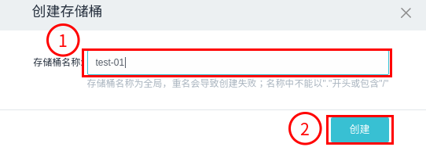

-  **查看属性**

选中一项存储桶名称前的复选框，单击“属性”按钮，即可查看当前存储桶详情，详情包括名称、大小及创建时间。

-  **删除存储桶**

选中一项存储桶名称前的复选框，单击“删除”按钮，如果当前存储桶为空，即可成功删除当前存储桶；如果当前存储桶非空，则删除失败，会看到提示“不能删除非空存储桶!”。如果想删除当前非空存储桶，需要去清除存储桶中的文件再进行删除操作，清除存储桶中的文件操作详见下方“删除文件”。

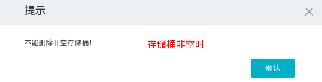

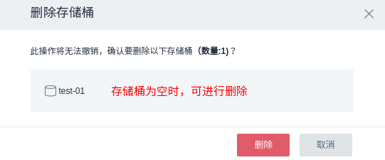

-  **进入存储桶**

   点击一项存储桶名称，进入可以操作该项存储桶的页面，其中操作包括如下：

   -  上传文件
      点击“上传”按钮，打开文件选择对话框，选择要上传的文件或将所要上传文件拖入框中完成上传。注意：在存储桶中，可以上传任意类型的文件到存储空间中。每次上传最多上传5个文件，单个文件最大为5GB。
      |image0|
   -  创建文件夹
      点击“创建文件夹”按钮，在弹框中输入文件夹名称，点击“创建”，即可成功创建一个新的文件夹。点击文件夹名称，进入新的操作页面，可以继续使用上传、创建文件夹、下载、复制、粘贴、删除等操作。

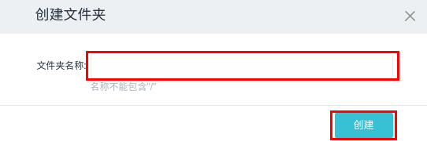

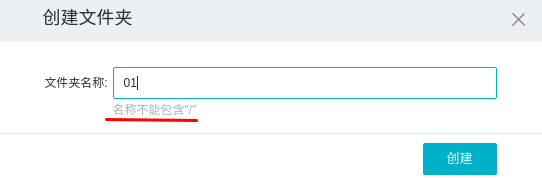

::

    * 下载 选中一项已上传的文件名称前的复选框，点击“下载”按钮即可成功下载该文件。
    * 复制 选中一项已上传的文件名称前的复选框，点击“更多”->单击“复制”按钮，即可成功复制该文件。
    * 粘贴 进入需要粘贴的文件夹，点击“更多”->单击“粘贴”按钮，即可将已复制的文件成功粘贴到当前文件夹中。
    * 属性 选中一项已上传的文件名称前的复选框，点击“更多”->单击“属性”按钮，会看到该文件的详细信息，包括基本属性，共享路径和权限许可等详细信息。其中，文件的共享方式分为私用和公用两种，当共享方式为私用时，需要自己在权限许可列表中自行添加可以读取该文件路径的项目（请添加已开启对象存储服务的项目）。

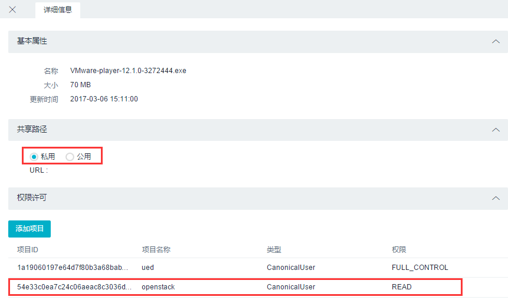

|image1| \* 删除文件夹
选中一项文件夹名称前的复选框，点击“更多”->单击“删除”按钮，如果所选文件夹为空，即可成功删除文件夹；如果所选文件夹非空，则删除失败，会看到提示“不能删除非空文件夹!”。如果想删除所选非空文件夹，需要去清除文件夹中的文件再进行删除操作，清除文件夹中的文件操作详见下方“删除文件”。

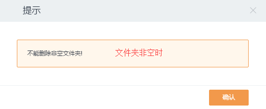

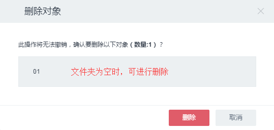

::

    * 删除文件 如果不再需要存储所上传的文件，可将其删除以免进一步产生费用。可以通过选中所要删除文件前的复选框，点击“更多”->单击“删除”按钮，在弹框中确认信息后点击“删除”，即可成功删除当前文件。

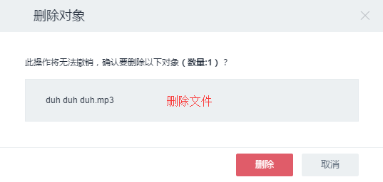

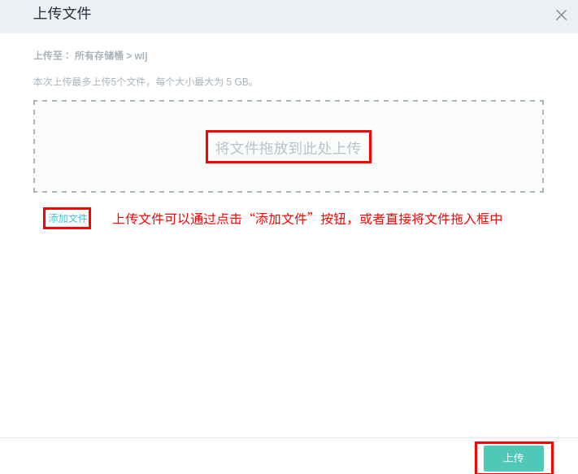
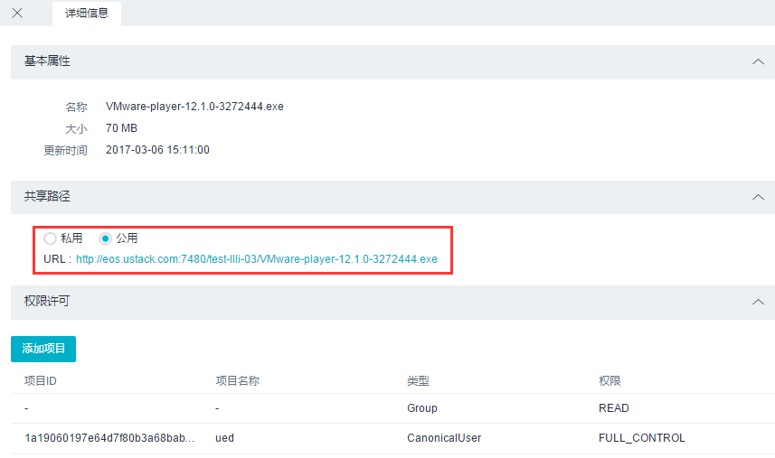

