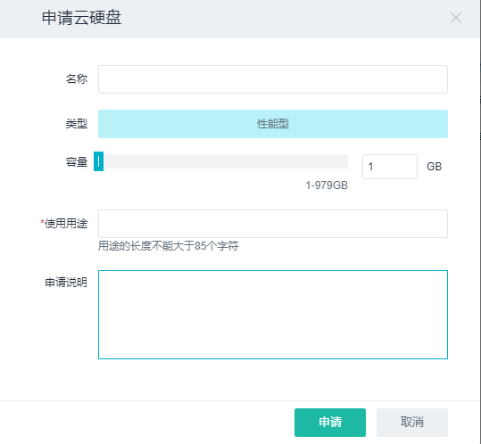
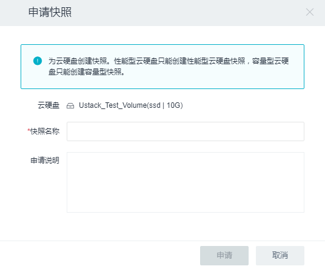
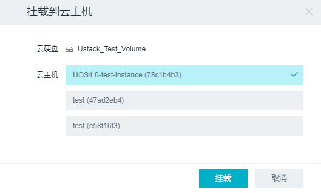
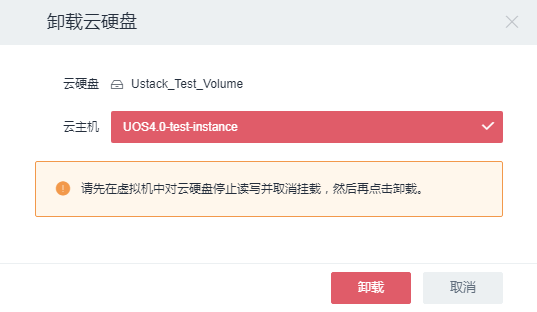
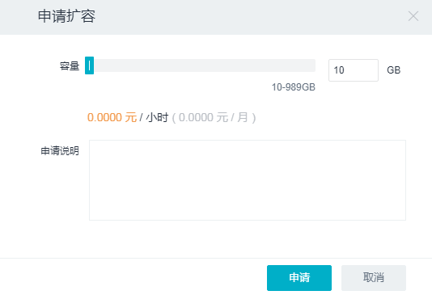
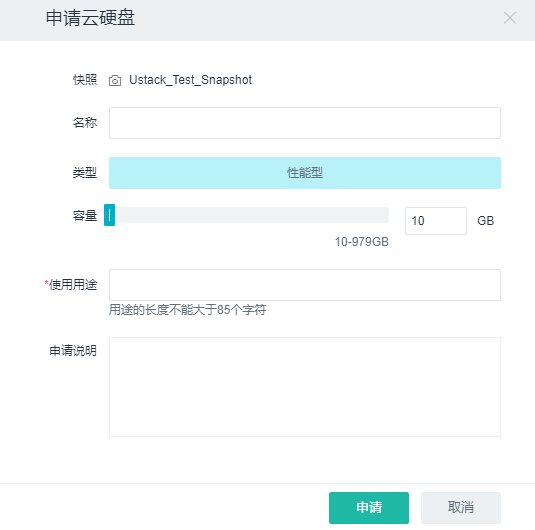

## 6.3 存储审批

> *__该服务在界面上对普通用户可隐藏__*

#### 1. 核心概念

详见[3.3 存储服务](../UOS项目平台/存储服务.md)

#### 2. 相关操作

目前审批系统对云硬盘的操作支持如下：

* __申请云硬盘__     

> *与项目平台相比，不可直接创建，需要申请。*
   
单击二级导航栏“云硬盘”-> 单击“申请云硬盘”按钮，在弹出框中的“名称”文本框中输入云硬盘名称，选择云硬盘类型和容量，单击“申请”按钮即可申请一块云硬盘。如图:

 

* __申请云硬盘快照__    

> *与项目平台相比，不可直接创建，需要申请。*
    
单击二级导航栏“云硬盘”->选中新创建的云硬盘名称前的复选框，单击“申请快照”按钮，在弹出框中输入“快照名称” ->单击“申请”按钮即可申请对云硬盘进行快照。如图:

 

* __挂载到云主机__    

> *功能与项目平台一致*

单击二级导航栏“云硬盘”->选中处于可用状态的云硬盘名称前的复选框，单击“挂载到云主机”按钮。在弹出框中选择需要挂载到的云主机->单击“挂载”按钮即可将云硬盘挂载到云主机。如图:

 

* __从云主机卸载__

> *功能与项目平台一致*

单击二级导航栏“云硬盘”->选中处于使用中状态的云硬盘名称前的复选框，单击“更多”按钮，点击“从云主机卸载”。在弹出框中选择云主机->单击“卸载”按钮即可将云硬盘从云主机卸载。如图:

 

* __申请扩容__     

> *与项目平台相比，不可直接更改，需要申请。*

单击二级导航栏“云硬盘”->选中处于“可用”状态的云硬盘名称前的复选框，单击“更多”按钮，在下拉列表中单击“申请扩容”按钮，在弹出框中设置硬盘容量，单击“申请”按钮即可申请对硬盘容量进行更改。对于处于“使用中”状态的硬盘不可进行申请扩容操作。如图:

 

* __设置云硬盘读写属性__    

> *功能与项目平台一致*

云硬盘创建成功后，默认属性为“读写盘”。如需更改硬盘属性，单击二级导航栏“云硬盘”->选中处于“可用”状态的云硬盘名称前的复选框，单击“更多”按钮，在下拉列表中单击“设置只读盘”按钮即可更改硬盘属性。如图:

 

* __更改拥有人__

> *审批系统新增功能*

单击二级导航栏“云硬盘”->选中云硬盘名称前的复选框，单击“更多”按钮，在下拉列表中单击“更改拥有人”按钮，在弹出框中填写拥有人，单击“确认”按钮即可更改拥有人。如图：

* __更改用途__

> *审批系统新增功能*

单击二级导航栏“云硬盘”->选中云硬盘名称前的复选框，单击“更多”按钮，在下拉列表中单击“更改用途”按钮，在弹出框中填写更改的用途，单击“确认”按钮即可更改用途。如图：

* __删除云硬盘__

> *功能与项目平台一致*

单击二级导航栏“云硬盘”->选中处于“可用”状态的云硬盘名称前的复选框，单击“更多”按钮，在下拉列表中单击“删除”按钮，单击“删除”按钮即删除云硬盘。对于处于“使用中”状态的硬盘不可进行删除操作。如图：

* __快照申请云硬盘__

> *与项目平台相比，不可直接创建，需要申请。*

单击二级导航栏“快照”-> 选中云硬盘快照名称前的复选框，单击“申请云硬盘”按钮，在弹出框中的“名称”文本框中输入云硬盘名称，选择云硬盘类型和容量，单击“申请”按钮即可申请一块云硬盘。如图:

 

* __删除云硬盘快照__

> *功能与项目平台一致*

单击二级导航栏“快照”-> 选中云硬盘快照名称前的复选框，单击“删除”按钮，在弹出框中单击“删除”按钮即可删除云硬盘快照。对于申请云硬盘成功的快照不可进行删除操作。如图:

* __创建报警__ 

单击二级导航栏“云硬盘”->选中一个云硬盘弹出详细信息页->点击“监控”标签，列有该云硬盘的**读写速率以及读写请求速率**的图表，单击“创建报警”按钮->在弹出框中填写相关信息（具体创建过程详见[3.4.1 报警](../UOS项目平台/监控报警服务.md#3.4.1 报警)），即可创建该云硬盘的一个报警，在“报警”标签列出了报警列表。
