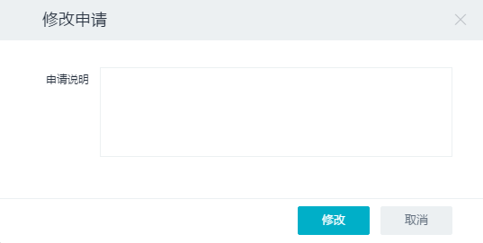
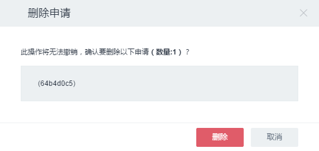
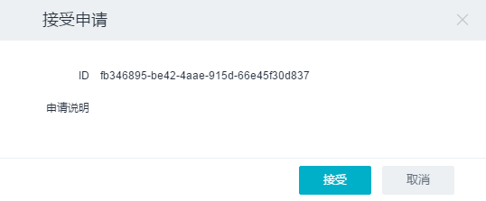
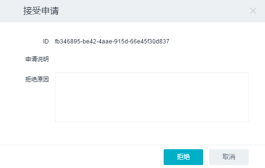
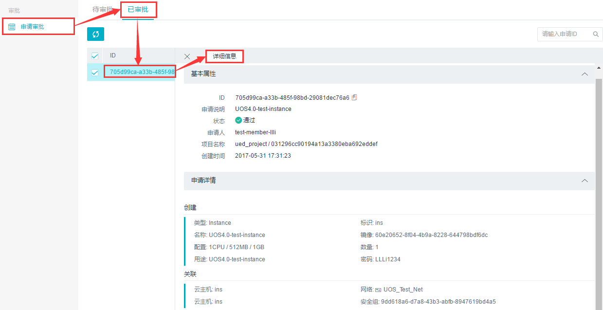

6.5 审批操作
------------

6.5.1 我的申请
~~~~~~~~~~~~~~

我的申请平台可列出当前用户的所有申请。\ **只有普通用户拥有该平台，管理员用户没有该平台。**

1. 相关操作
^^^^^^^^^^^

**普通员工：**

-  **修改申请**

单击二级导航栏“我的申请”->选中处于“待审批”状态的申请，点击“修改申请”按钮，填写申请说明，点击“修改”按钮即可修改成功。

-  **删除申请**

单击二级导航栏“我的申请”->选中处于“待审批”状态的申请，点击“删除”按钮，在弹出框中点击“删除”按钮即可删除成功。

6.5.2 申请审批
~~~~~~~~~~~~~~

申请审批平台可列出低一级用户提交的待审批和已审批申请，并进行审批操作。

1. 相关操作
^^^^^^^^^^^

**管理员：**

-  **接受申请**

点击二级导航栏“申请审批”->选中待审批的申请，单击“接受申请”按钮->单击“接受”按钮即可接受申请。

-  **拒绝申请**

点击二级导航栏“申请审批”->选中要拒绝的申请，单击“拒绝申请”按钮，拒绝原因可不填写->单击“拒绝”按钮即可拒绝申请。

-  **查看已审批申请**

点击二级导航栏“申请审批”->单击“已审批”标签，即可看到所有已经审批过的申请（包括通过和未通过的）。

