6.1 计算审批
------------

6.1.1 云主机审批
~~~~~~~~~~~~~~~~

1. 核心概念
^^^^^^^^^^^

请查看\ `3.1.1
云主机服务 <../UOS项目平台/计算服务.md#311-云主机服务>`__\ 中的相关概念。

2. 相关操作
^^^^^^^^^^^

目前审批系统对主机的操作支持如下：

    ***与项目平台相比，审批系统的云主机服务少了更改密码功能，增加了“一键创建”功能以及更改拥有人和更改用途功能。***

-  **一键创建**

单击二级导航栏“创建云主机”，在页面中填写相关信息：云主机名称，选择镜像，选择合适的配置（包括CPU类型、内存容量和系统盘容量），选择网络和安全组，选择登录信息（只能密码登录），选择是否勾选“创建公网IP并绑定”（\ **上方选择的网络中有子网连接了路由器此项才会显示**\ ）和“创建云硬盘并挂载”（若勾选则需额外输入云硬盘名称以及容量），单击“创建申请”即可，如图：

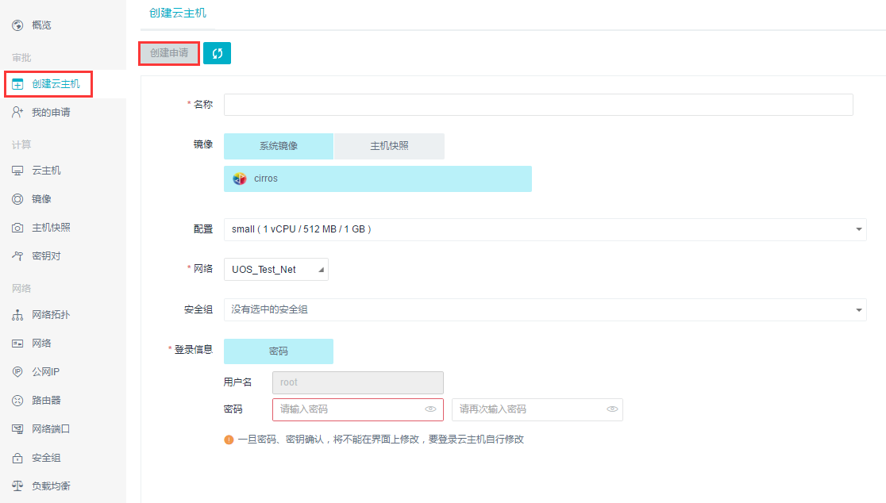

-  **申请云主机**

单击二级导航栏“云主机”，单击“申请云主机”
->在页面中的文本框输入主机名称，并选择镜像，如图：

单击“下一步”，单击“配置”，在下拉框中选择CPU类型、内存容量和硬盘容量，单击“折叠”按钮，如图：

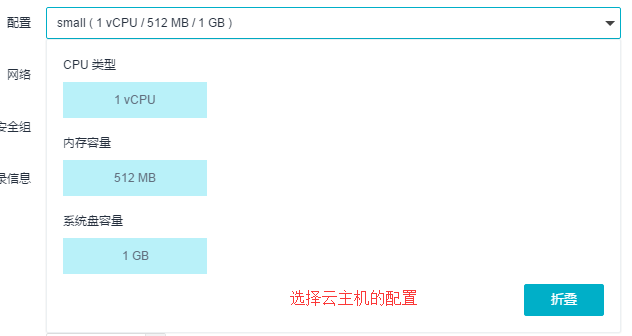

单击“网络”，在下拉框中选择一个私有网络->单击“安全组”，选择一个安全组，单击“折叠”按钮，如图：

若使用密钥对登录，单击“密钥对”，选择所需的密钥；若使用密码登录，单击“密码”，在文本框中输入密码（密码要求必须以数字或字母开头，同时包含大写字母、小写字母、数字，并且长度在8－20位字符之间。）以及确认密码，如图：

***备注**\ ：* > *目前登录信息只有密码登录。*

| 设置创建的云主机的数量（不得小于1）->单击“下一步”按钮。填写使用用途（用途的描述不得多于85个字）和申请说明，单击“创建”按钮即可完成申请。如图：
| |image0|

-  **开机/关机/重启/删除**

    *功能跟项目平台一致。*

| 单击二级导航栏“云主机”，页面上会呈现“开机”和“关机”按钮。若云主机处于开机状态，只需选中云主机名称前的复选框，单击“关机”按钮即可将云主机关机。若云主机处于关机状态，只需选中云主机名称前的复选框，单击“开机”按钮即可将云主机开机。若想重启云主机，选中云主机名称前的复选框，单击“更多”按钮->在下拉菜单中单击“重启”按钮即可实现云主机的重启工作。如图：
| |image1|

-  **VNC登录**

    *功能跟项目平台一致。*

| 单击二级导航栏“云主机”->选中云主机名称前的复选框，单击“VNC登录”即可快速管理云主机；或者选中一个云主机弹出详细信息页，点击“VNC登录”。如图：
| |image2|

-  **申请更改配置**

    *与项目平台相比，审批系统将直接更改改为了申请。*

| 单击二级导航栏“云主机”，选中云主机名称前的复选框，单击“更多”按钮->单击“申请更改配置”，在弹出框中修改需要更改的配置，包括CPU类型、内存容量和云硬盘容量。->单击“申请”按钮，填写“申请说明”，即可完成申请。如图：
| |image3|

-  **申请主机快照**

    *与项目平台相比，审批系统将直接创建改为了申请。*

| 单击二级导航栏“云主机”，选中云主机名称前的复选框，单击“更多”按钮->单击“申请主机快照”，在弹出框中输入主机快照的名称，填写申请说明->单击“申请”按钮，即可完成申请。如图：
| |image4|

-  **更改拥有人**

单击二级导航栏“云主机”，选中云主机名称前的复选框，单击“更多”按钮->单击“更改拥有人”，在弹出框中输入更改的拥有人名称->单击“确认”按钮，即可完成更改。如图：

-  **更改用途**

单击二级导航栏“云主机”，选中云主机名称前的复选框，单击“更多”按钮->单击“更改用途”，在弹出框中输入更改用途->单击“确认”按钮，即可完成更改。如图：

-  **绑定/解绑公网IP**

    *功能跟项目平台一致。*

| 单击二级导航栏“云主机”，选中云主机名称前的复选框，单击“更多”按钮->若云主机未绑定公网IP，单击“绑定公网IP”，在弹出框中点击“公网IP”，在下拉框中选择公网IP->单击“绑定”按钮即可给云主机绑定公网IP。若云主机已绑定公网IP，单击“解绑公网IP”，在弹出框中单击“解绑”按钮即可解绑公网IP。如图：
| |image5|

-  **加入网络**

    *功能跟项目平台一致。*

| 单击二级导航栏“云主机”，选中云主机名称前的复选框，单击“更多”按钮->单击“加入网络”，在弹出框中单击“选择子网”（或“选择网络端口”），在下拉框中选择需要加入的网络（或网络端口）->单击“加入”按钮即可实现云主机加入网络。如图：
| |image6|

-  **修改安全组**

    *功能跟项目平台一致。*

| 单击二级导航栏“云主机”，选中云主机名称前的复选框，单击“更多”按钮->单击“修改安全组”，在弹出框中单击“网络端口”，在下拉框中选择需要修改的网络端口。选择安全组类型->单击“保存”按钮即可修改云主机的安全组规则。如图：
| |image7|

-  **挂载云硬盘**

    *功能跟项目平台一致。*

| 单击二级导航栏“云主机”，选中云主机名称前的复选框，单击“更多”按钮->单击“挂载云硬盘”，在弹出框中选择云硬盘类型，选中需要挂载的云硬盘->单击“挂载”按钮即可将云硬盘挂载到云主机。如图：
| |image8|

-  **卸载云硬盘**

    *功能跟项目平台一致。*

| 如图：
| |image9|

详见\ `3.1.5存储服务 <../UOS项目平台/云主机服务.md#315-存储服务>`__\ 。

-  **创建报警**

单击二级导航栏“云主机”->选中一个云主机弹出详细信息页->点击“监控”标签，列有该云主机的\ **CPU使用率、内存使用率、磁盘读速率、磁盘写速率、网络端口传入平均速率和网络端口传出平均速率**\ 的图表，单击“创建报警”按钮->在弹出框中填写相关信息（具体创建过程详见\ `3.4.1
报警 <../UOS项目平台/监控报警服务.md#3.4.1%20报警>`__\ ），即可创建该云主机的一个报警，在“报警”标签列出了报警列表。

6.1.2 镜像
~~~~~~~~~~

    ***与项目平台相比，审批系统的镜像页面只支持查看功能。***

在镜像页面中，可以查看镜像的所有信息，包括名称、容量、类型、状态、创建时间等。如图：

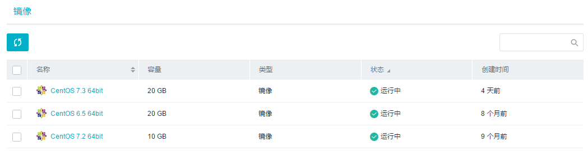

6.1.3 主机快照
~~~~~~~~~~~~~~

    ***与项目平台相比，审批系统的主机快照页面只支持查看和删除功能。***

-  **查看主机快照**

| 在主机快照页面中，可以查看主机快照的所有信息，包括名称、容量、类型、状态、创建时间等。如图：
| |image10|

-  **删除主机快照**

单击二级导航栏“主机快照”，选中要删除的主机快照名称前的复选框，单击“删除”按钮即可将主机快照删除。如图：
|image11|

6.1.4 密钥对
~~~~~~~~~~~~

    ***功能跟项目平台一致。***

请查看\ `3.1.4 密钥对服务 <../UOS项目平台/计算服务.md#314-密钥对服务>`__

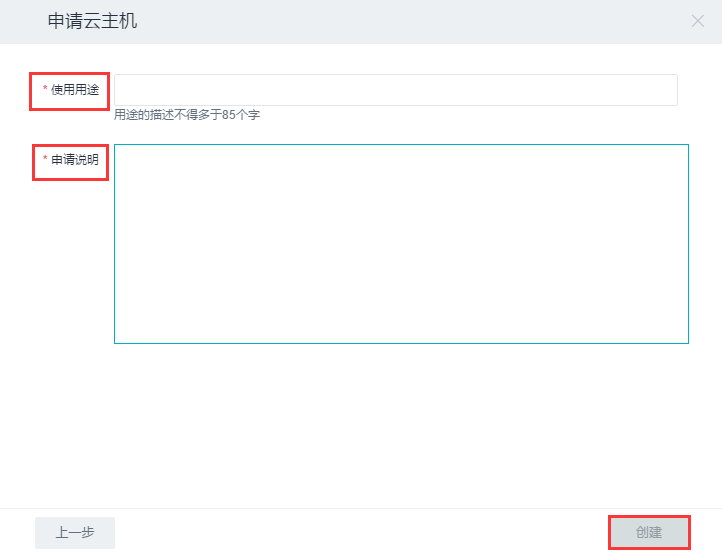

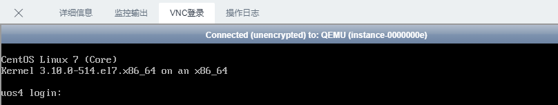
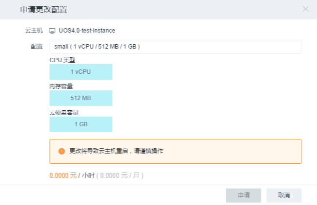
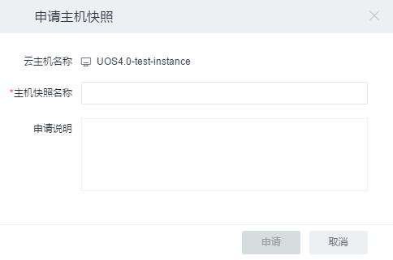
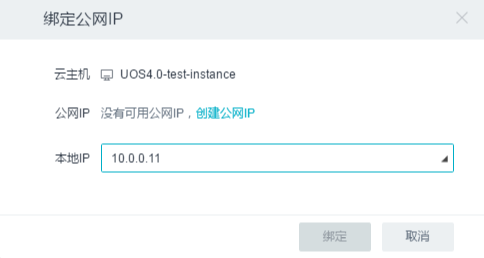
.. |image6| image:: ../../img/Approval/Compute/6-1-1-014.png
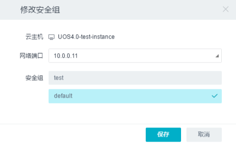
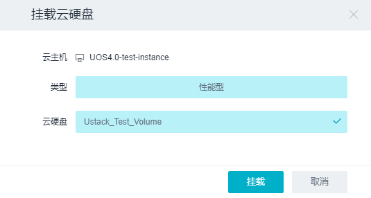
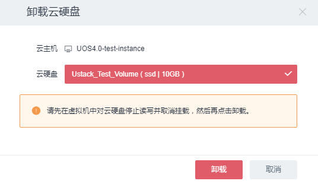

