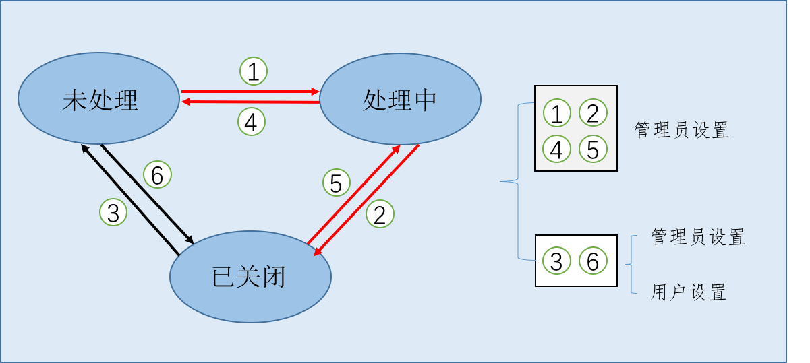

8.2 管理平台工单
----------------

UOS云平台为管理员提供工单管理功能，使得管理员能够通过平台为用户提供诸如咨询、故障和申请的服务。解决了用户遇到疑惑无处可寻的问题，也使得管理员可以专心投入自己的工作中。同时，通过工单系统，可使得用户与管理员之间的沟通标准化、规范化。

8.2.1 工单生命周期
~~~~~~~~~~~~~~~~~~

工单一经创建成功，便有了自己的生命周期。根据其状态，可以将工单分为\ **未处理**\ 、\ **处理中**\ 和\ **已关闭**\ 三种状态。如下图示：

-  **未处理**\ 是指工单已创建完成，但是管理员或集群管理员还未对工单进行处理或者由于管理员处理过程中发现未能解决该工单提出的问题又将工单状态改为未处理。

在该阶段，用户可以对工单进行修改和补充，发送额外的信息以及添加更多附件。但是管理员或集群管理员无法回复工单。\ **管理员**\ 还有一项操作：\ **移交上级管理员**\ 。管理员可以把工单移交给上一级的管理员（\ **集群管理员**\ ）。一旦移交操作被触发，该工单状态重新变为未处理。

-  **处理中**\ 是指工单已经正式开始进入处理的状态，一个工单一旦开始处理，便进入处理中的状态。\ **此时，该工单对其他管理员不可见**\ 。

在该阶段，用户可以对工单进行修改和补充，发送额外的信息以及添加更多附件。同时作为管理员，也可以在工单中发送消息以及附件，和用户进行沟通。\ **管理员**\ 还有一项操作：\ **移交上级管理员**\ 。管理员可以把工单移交给上一级的管理员（\ **集群管理员**\ ）。一旦移交操作被触发，该工单状态重新变为未处理。

-  **已关闭**\ 是指工单已处理完成或者创建工单的用户觉得自己的问题可以不需要管理员处理了或者管理员已经解决了该问题或是已经和用户沟通完毕了而自行关闭工单。用户或管理员双方都可以在某个合适的时间点来关闭工单。

在该阶段，用户和管理员都可以选择重新打开工单，这样，工单就恢复到指定状态（用户打开工单恢复到未处理状态）。\ **管理员**\ 还有一项操作：\ **移交上级管理员**\ 。管理员可以把工单移交给上一级的管理员（\ **集群管理员**\ ）。一旦移交操作被触发，该工单状态重新变为未处理。

8.2.2 管理平台工单使用说明
--------------------------

目前对管理平台工单系统的操作支持如下：

-  **（工单为未处理状态页面）更新工单状态为处理中/已关闭；**
-  **（工单为处理中状态页面）更新工单状态为未处理/已关闭；**
-  **（工单为已关闭状态页面）更新工单状态为未处理/处理中。**

点击最左侧“管理工单”进入管理工单界面->接着点击“未处理”便可看到所有未处理的工单。管理员可以根据工单的类型或标题等信息选择自己可以解决的工单，选中后点击“更新为处理中”将工单状态切换至处理中。另一种情况是直接将未处理的工单切换至已关闭状态。由于工单的三种状态可以随意切换，若管理员将处理中的工单更新为未处理状态，而其他管理员认为该工单的回复已达到解决问题的目的，便可将该工单切换至已关闭的状态。

**工单处于“未处理”状态和“已关闭”状态时，任何管理员不可对工单进行回复。**

管理员点击“处理中”便可看到且只能看到自己手中所有处于处理中的工单。管理员手中的工单只对自己可见，其他管理员无法看到。对于处于处理中的工单，管理员可以点击工单“标题”，在跳转的页面进行回复。回复内容可以是文字，也可以是文件和图片，但是只支持格式为JPG/PNG/GIF/BMP/PIC/TIF的图片和文件，最多可上传5个文件。待回复内容输入完毕，点击“提交”按钮即完成回复。用户也可继续进行回复，与管理员进行沟通。当管理员认为该工单已处理完，即可将工单状态“更新为已关闭”。

管理员点击“已关闭”便可看到所有处于关闭状态的工单，包括其他管理员关闭的。对于已关闭的工单，可根据需求再次切换至未处理和处理中的状态。工单处于已关闭状态时，任何人不可再进行回复。只有将工单切换至处理中状态才可进行回复。点击已关闭的工单的标题处，可以看到工单回复的历史纪录信息，方便查询纪录。
