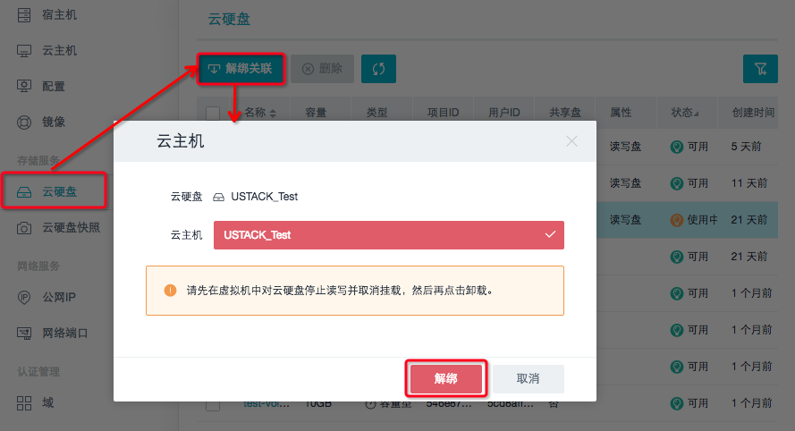

## 4.2 存储管理服务

### 4.2.1 云硬盘管理

UOS管理平台为客户提供对云硬盘的管理功能。当用户发现该硬盘出现异常时，可直接将该硬盘与云主机解除关联，从而保护云主机本身的数据不受影响。当然，更加直接的办法就是将该硬盘直接删除。总之，管理员对控制台创建的所有硬盘都有操作权限。

目前UOS管理平台对云硬盘管理的操作支持如下：

* __导出CSV；__
* __修改/删除云硬盘；__
* __将云硬盘与云主机解绑关联；__
* __查看云硬盘监控。__

*__备注__ ：*
> *需要先将云硬盘取消挂载，再从原来的主机上解绑，最后才可以卸载。*

### 4.2.2 云硬盘快照管理

为了能够对已有的硬盘进行备份，保证数据的可重现，UOS云平台为用户提供硬盘快照的功能。

目前UOS管理平台对云硬盘快照管理的操作支持如下：

* __导出CSV；__
* __修改云硬盘快照名称；__
* __删除云硬盘快照。__