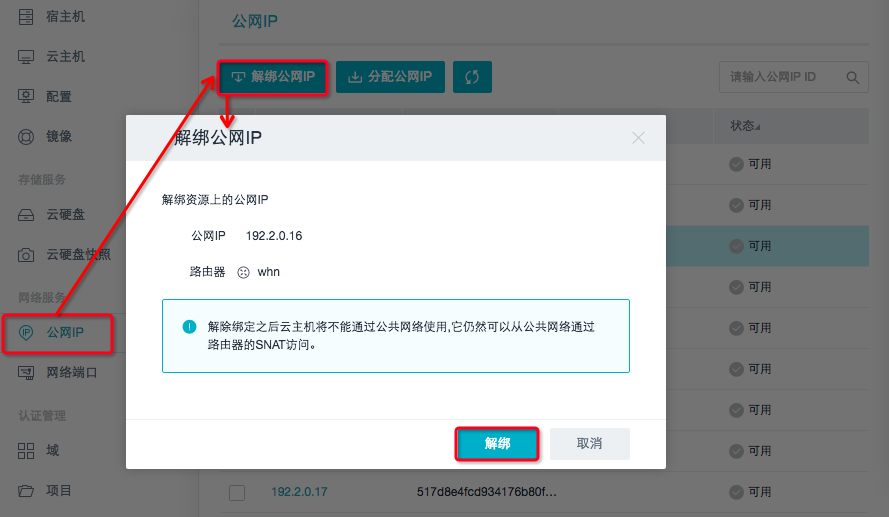
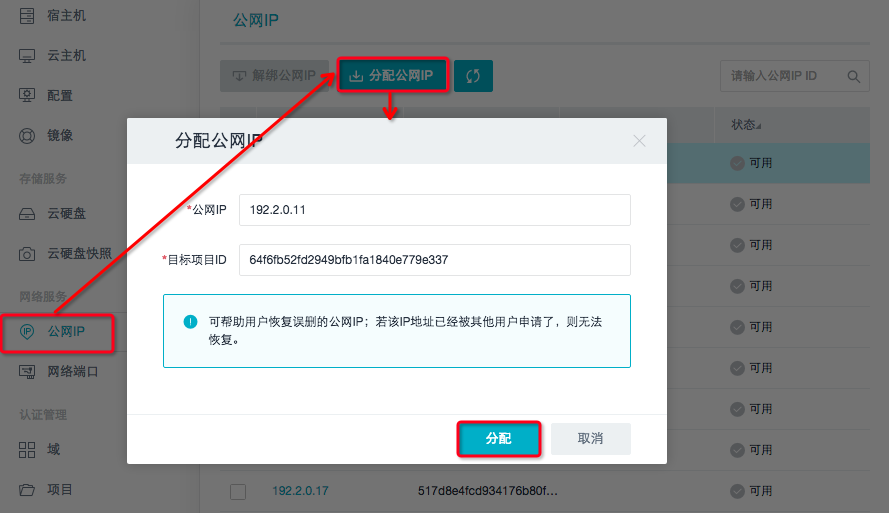

## 4.3 网络管理服务

### 4.3.1 公网IP管理

为了能够使创建的云主机与外部进行网络访问，用户会在控制台申请一个公网IP来使云主机连接到互联网。当管理员发现该网络被恶意攻击时，管理员可以有权限解绑公网IP，保证主机不受攻击。若用户不小心误删除某公网IP时，可向管理员申请恢复该公网IP。但是，若该IP已被其他用户申请，则无法恢复。

目前UOS管理平台对公网IP管理的操作支持如下：

* __解绑公网IP；__
* __分配公网IP；__
* __导出CSV。__

### 4.3.2 网络端口管理

网络端口向管理员呈现控制台的所有网络端口的信息。

目前UOS管理平台对网络端口管理的操作支持如下：

* __删除网络端口。__