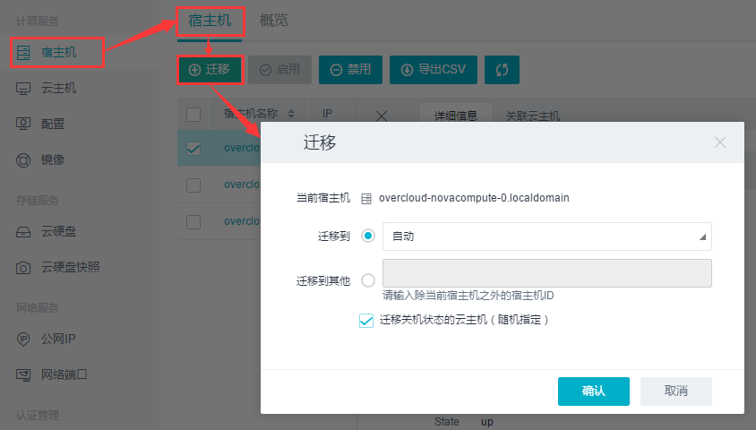
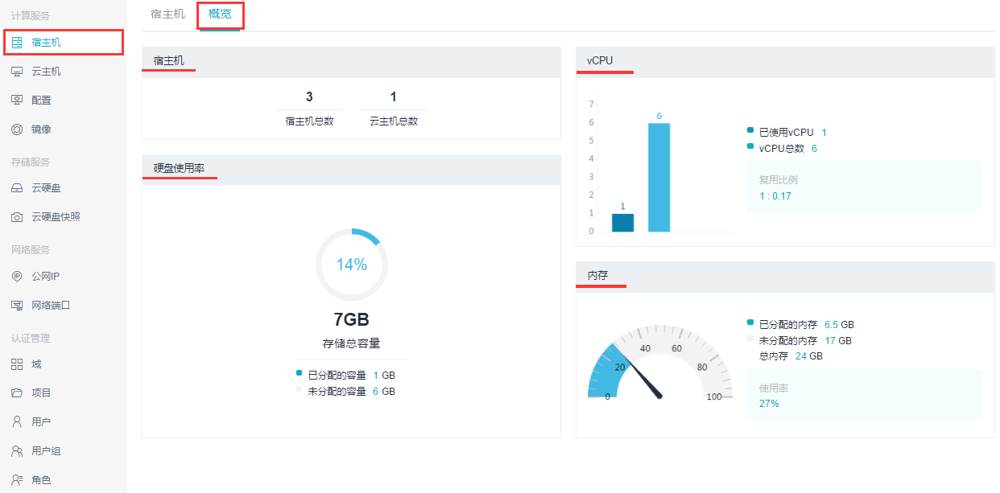
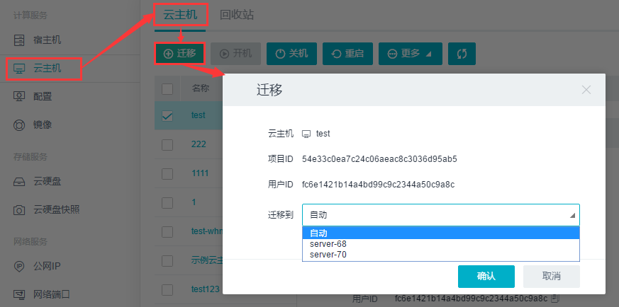
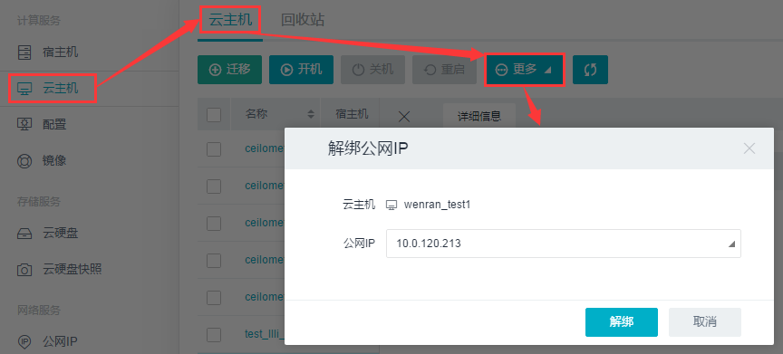
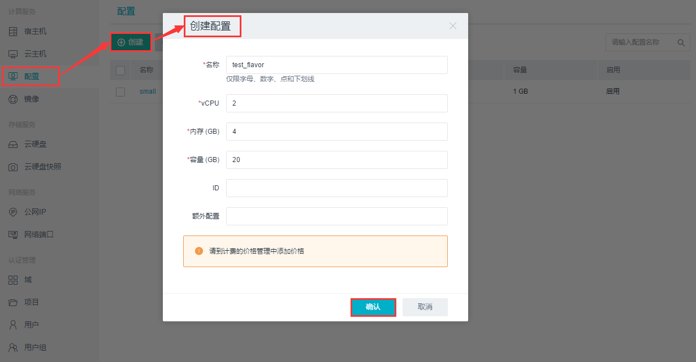

## 4.1 计算管理服务

### 4.1.1 宿主机

宿主机是部署OpenStack的所有服务的“栖身之所”，即所有的云服务都运行在这些宿主机上。根据业务需求与规模的差异，可以部署不同数量的宿主机。当一个宿主机出现故障时，该主机上的业务可实现自动迁移，根据相关的调度策略，将故障主机上的业务迁移至最优主机上，实现数据的无缝迁移与安全可靠。

目前对宿主机的操作支持如下：

* __迁移(宿主机上)所有主机，包括自动迁移和指定迁移；__
* __启用/禁用某一宿主机；__
* __导出CSV；__
* __查看宿主机上关联的云主机列表；__
* __查看宿主机配置使用情况，包括宿主机总数，宿主机上云主机总数，虚拟CPU和真实CPU的总数，内存使用情况以及硬盘使用率等。__

### 4.1.2 云主机管理

UOS管理平台为客户提供的云主机管理功能包括云主机和回收站，云主机可以罗列出所有项目的所有云主机的基本信息，回收站可以罗列出删除100s以内云主机的部分信息。云主机管理功能主要提供对所有云主机的管理功能。管理员可以按照需要对控制台的主机进行迁移、开机、关机等操作，保证云环境的安全稳定及高效运行。

目前UOS管理平台对云主机和回收站的操作支持如下：
* __云主机__
 * __迁移单台云主机至其他宿主机；__
 * __开机/关机/重启/删除云主机；__
 * __解绑公网IP；__
 * __导出CSV；__
 * __查看云主机监控；__
 * __查看云主机操作日志。__

### 4.1.3 配置管理

UOS管理平台为客户提供的Flavor的管理平台，使客户能够自行按需创建Flavor的类型，即创建一个云主机时选择的vCPU的个数、内存大小以及硬盘容量，真正实现按需定制。

**配置（Flavor）**：在UOS中，配置是指CPU和内存的某个配比。关于其配比，我们可以按需定制。UOS 4.0中提供如下配比：

|     **配置**     | **vCPU** | **内存（GB）** |
| :-------------: | :-----: | :-----------: |
|     small       |    1    |      0.5      |

目前UOS管理平台对Flavor的操作支持如下：

* __创建新的Flavor类型；__
* __删除已存在的Flavor类型。__

### 4.1.4 镜像管理

UOS管理平台为客户提供的对镜像的管理功能，使客户可以对已存在镜像（包括快照）进行修改和删除。

目前UOS管理平台对镜像管理的操作支持如下：

* __创建镜像；__
* __修改镜像；__
* __导出CSV；__
* __查看镜像关联的云主机列表；__
* __删除已有镜像。__