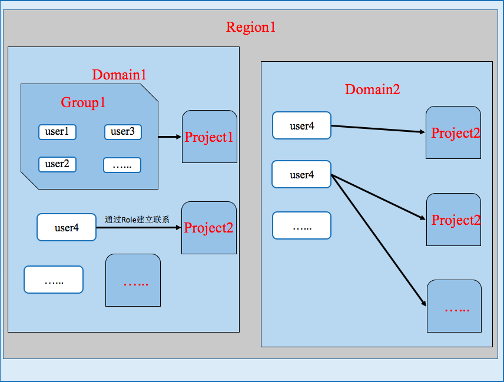
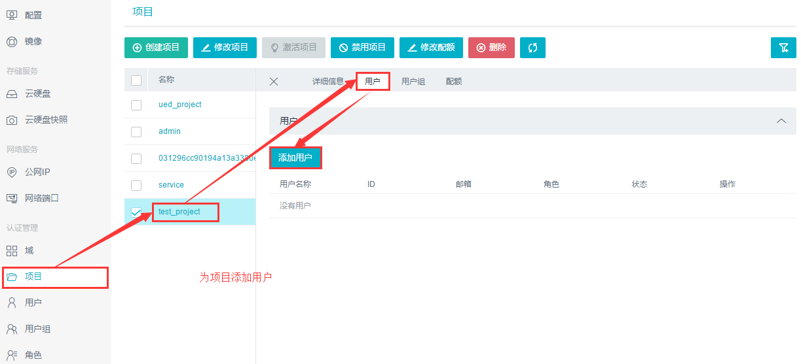
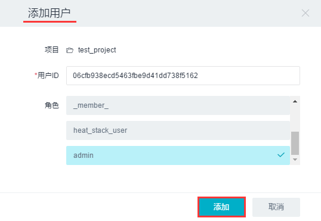
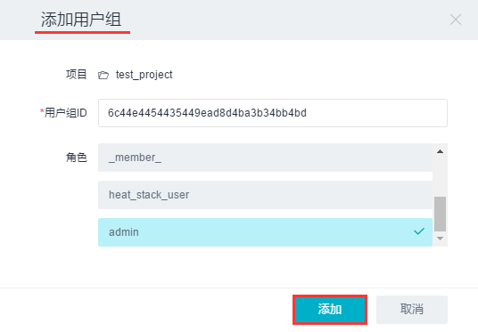
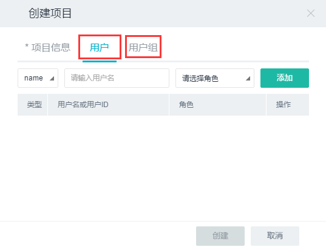
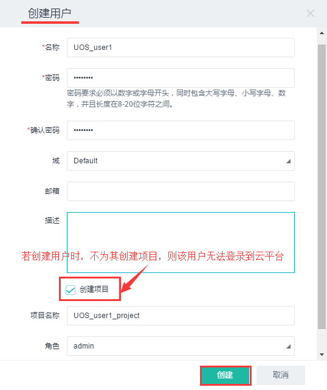
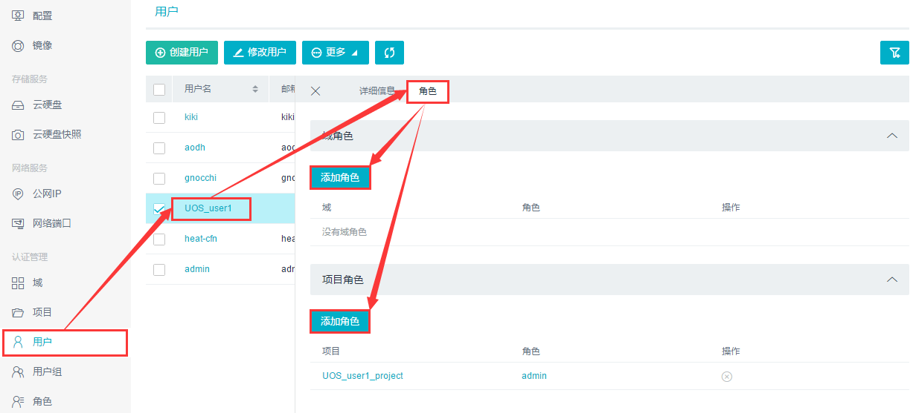
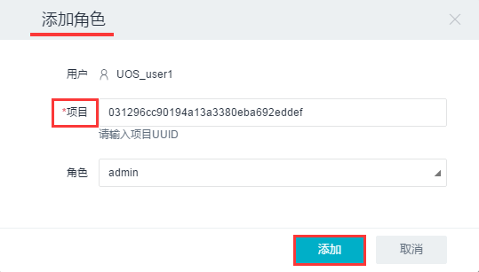
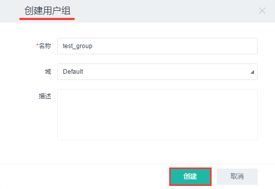

4.4 认证管理
------------

UOS的认证管理即身份认证管理服务，它来源于OpenStack的Keystone项目，主要用于用户访问资源时身份与权限的认证。其中涉及到一些重要的概念，以下给出相关对象的关系图：

如上图所示，我们可以看出一个Domain中可以包含多个Project，可以通过Group1将Role
admin直接赋予Domain，则Group1中的所有用户都将会对Domain1中的所有Projects拥有admin权限。也可以通过Group2将Role
demo只赋予给Projects3，这样Group2中的User就只拥有对Projects3相应的权限，而不会影响到其它Projects。

4.4.1 域（Domain）
~~~~~~~~~~~~~~~~~~

域是一个项目和用户的集合，用于为管理身份入口定义管理边界。它可以代表个人，公司或者运营商拥有的空间。简言之即为项目或用户做隔离。域管理员可以在域中创建项目、用户和组，并将角色分配给域中的用户和组。在一个域中，可以创建多个项目。每个组和项目由一个域拥有。

目前UOS管理平台对于域管理的操作支持如下：

-  **修改域的名称；**
-  **激活/禁用域（目前不能执行该操作）。**

4.4.2 项目（Project）
~~~~~~~~~~~~~~~~~~~~~

一个用户组或资源隔离或标识对象的容器。根据服务运营商的不同，一个项目可能会映射到一个客户、账户、组织或租户。一个UOS控制台即可视为一个项目，项目拥有资源的集合。一个项目可以拥有多个用户，这些用户可以根据权限的划分使用项目中的资源。

目前UOS管理平台对项目的操作支持如下：

-  **创建/修改/删除项目；**
-  **激活/禁用项目；**
-  **为项目添加用户；**
-  **为项目添加用户组；**
-  **为项目修改配额（即每个服务对应的数量）。**

4.4.3 用户（User）
~~~~~~~~~~~~~~~~~~

用户可以被直接分配到一个指定的项目中，可看作是该用户包含在该项目中。不论是人，服务，还是操作系统都可看作是使用服务的用户，凡使用UOS云服务的对象都可称为用户。

目前UOS管理平台对用户的操作支持如下：

-  **创建/修改/删除用户；**
-  **激活/禁用用户；**
-  **修改用户所在的主项目；**
-  **为用户修改密码；**
-  **为用户加入用户组；**
-  **为用户添加域角色；**
-  **为用户添加项目角色。**

点击“创建用户”按钮，给该用户命名，设置密码，即可快速创建一个新的用户。如下图所示，为创建用户的界面图：

当创建一个用户后，可以为该用户添加域角色或项目角色，如下图示：

4.4.4 用户组（Group）
~~~~~~~~~~~~~~~~~~~~~

目前UOS管理平台对用户组的操作支持如下：

-  **创建/修改/删除用户组；**
-  **为用户组添加用户；**
-  **为用户组添加域角色；**
-  **为用户组添加项目角色。**

4.4.5 角色（Role）
~~~~~~~~~~~~~~~~~~

角色用一组定义的用户权限和特权的人来执行特定的操作。当用户调用一个服务时，该服务读取用户角色集的设置，根据角色不同决定赋予不同用户不同的操作和访问权限。角色的存在将用户与项目或域关联起来，一个没有分配角色的用户没有访问云服务的权限。

目前UOS管理平台对角色的操作支持如下：

-  **创建/修改/删除角色。**

创建角色时，只需给出所创建的角色的名称即可快速创建一个新角色。
