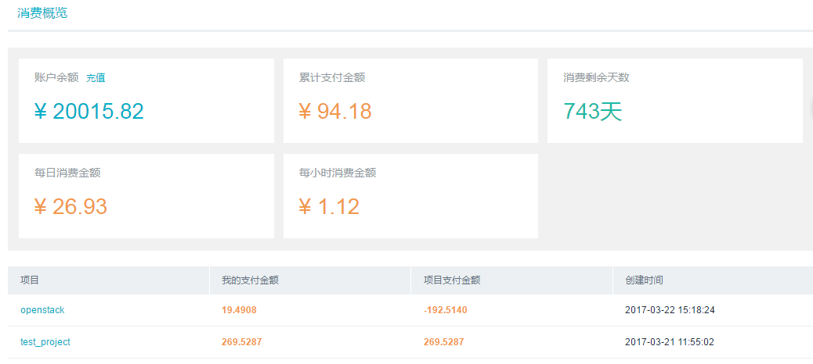

## 5.2 计费平台

UOS为客户提供计费平台。按照角色的不同计费操作也略有差别。

**普通用户：**

* __账户消费__
  * __消费概览__
  ：该平台展示了该账户的消费情况，包括账户余额（**点击“充值”可为该账户充值**），累计支付金额，消费剩余天数，每日消费金额，每小时消费金额和该账户为项目支付的金额以及项目支付金额。
  
  
  
  * __消费记录__
  ：该平台会记录所有的项目对应的所有区域的所有状态的服务的使用情况，包括运行中、已停止、已删除、正在转换和错误的资源。可以通过设置项目、区域和资源运行的状态，对资源进行筛选，并查看资源的消费情况。我们提供的资源的消费明细栏目包括资源开始时间、资源结束时间、资源类型、消费产生的金额数目、当前该资源的单价以及对该资源的注释说明。让客户可以直观了解项目资源的消费情况。
  * __账户充值__
  ：该平台可为账户充值，其中列出了账户余额，可输入充值金额（目前设定**“单笔充值金额最少10元且必须为整数”**，可自行定制）以及选择支付方式（支付宝、PayPal），点击“充值”按钮即可为该账户充值。
  * __充值记录__
  ：该平台会记录该账户的每次充值情况，包括充值金额、充值类型、资金渠道和充值时间。
  
**管理员用户：**

* __账户消费__（同**普通用户**）
* __计费管理__
  * __用户充值__
  ：该平台可为所有用户充值。
  * __价格管理__
  ：该平台可创建价格、修改价格和删除价格。真正实现价格定制化管理。
  * __全局充值记录__
  ：该平台会记录所有用户的充值情况，包括充值金额、充值类型、用户、资金渠道和充值时间。