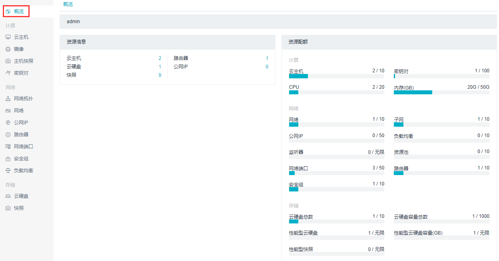

# 第3章 UOS项目平台

UOS项目平台可以简单地认为是一个项目的资源使用情况列表，它为用户提供基于OpenStack开发的基础设施服务。通过控制平台，用户可以体验UOS云平台对外提供的各项云服务，如云主机、云硬盘、公网IP等。让您随时随地搭建符合条件的工作环境，方便快捷。

* UOS项目平台的资源使用情况概览图如下：

UOS云平台由一系列云服务组成，通过这些服务，我们可以创建一台为自己“量身定制”的虚拟机，该虚拟机可以满足自己的商业需求或者工作需求。接下来我们将按照功能划分为大家介绍UOS云平台主要的服务。

*__备注：__*

> *1.UOS项目平台所有ID均可复制；*

> *2.UOS项目平台新增功能：**云主机更多操作（包括暂停和取消暂停、挂起和恢复、锁定和解锁、救援和恢复救援、重建云主机）**，**云主机操作日志**,**云主机错误消息detail**。具体操作见下方*

