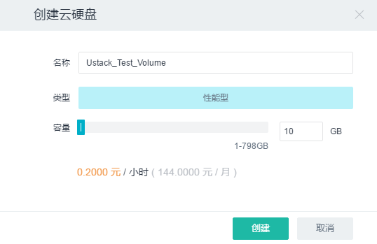
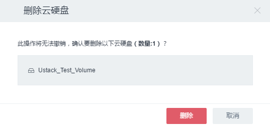
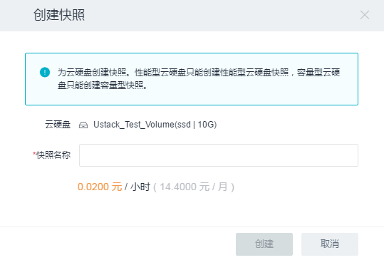
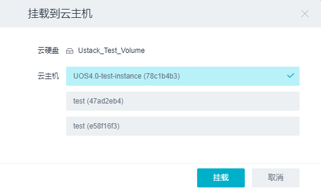
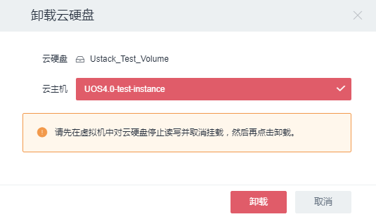
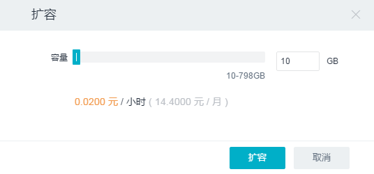
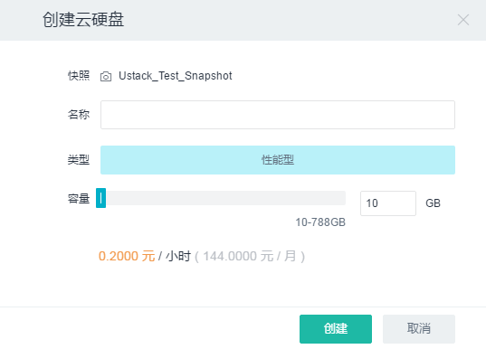

## 3.3 存储服务

UOS云平台为云主机提供持久化的块存储服务，即云硬盘服务。它使用多种先进技术，即使出现服务器故障的情况，也不会影响数据的可靠性和可用性，让用户高枕无忧。且关于云硬盘的各种操作都可在秒级完成，无需等待，流畅体验UOS块存储的极致服务。

### 3.3.1 云硬盘

云硬盘服务独立于云主机，可以被挂载到任意云主机上，也可以随时从云主机卸载，转接至其它云主机，实现数据的无缝迁移。云硬盘服务采用多重副本分布式架构，多硬盘同时读写，为云主机提供99.999999%的数据可靠性保证。即使出现服务器故障的情况，也不会影响数据的可靠性和可用性，让用户高枕无忧。根据应用场景的不同，将云硬盘服务分为两类：容量型和性能型。详见如下：

#### 1. 核心概念

* **容量型云硬盘**：即使用普通的SATA磁盘作为存储介质，利用分布式多重副本机制提供的存储资源池。单块容量型硬盘最小提供1GB，最大提供1000GB的存储空间

* **性能型云硬盘**：即使用SSD磁盘作为存储介质，利用分布式多重副本机制提供的存储资源池。

#### 2. 相关操作

目前对云硬盘的操作支持如下：

* __创建云硬盘__ 

单击二级导航栏“云硬盘”-> 单击“创建云硬盘”按钮，在弹出框中的“名称”文本框中输入云硬盘名称，选择类型（性能型、容量型）和容量，单击“创建”按钮即可创建一块云硬盘。

* __删除云硬盘__ 

单击二级导航栏“云硬盘”->选中新创建的云硬盘名称前的复选框，单击“更多”按钮->单击“删除”按钮即可删除一块处于“可用”状态的云硬盘。对于“使用中”的云硬盘不能直接删除，需单击“更多”按钮单击->单击“从云主机卸载”，在弹出框中单击“卸载”按钮即可将云硬盘从云主机上卸载。接下来便是按照“删除云硬盘”的步骤进行删除即可。

* __创建云硬盘快照__ 

单击二级导航栏“云硬盘”->选中新创建的云硬盘名称前的复选框，单击“创建快照”按钮，在弹出框中输入“快照名称” ->单击“创建”按钮即可对云硬盘进行快照。

* __挂载到云主机__ 

单击二级导航栏“云硬盘”->选中处于可用状态的云硬盘名称前的复选框，单击“挂载到云主机”按钮。在弹出框中选择需要挂载到的云主机->单击“挂载”按钮即可将云硬盘挂载到云主机。

* __从云主机卸载__ 

单击二级导航栏“云硬盘”->选中处于使用中状态的云硬盘名称前的复选框，单击“更多”->单击“从云主机卸载”按钮。在弹出框中选择需要卸载的云主机->单击“卸载”按钮即可将云硬盘从云主机卸载。

* __云硬盘扩容__ 

单击二级导航栏“云硬盘”->选中处于“可用”状态的云硬盘名称前的复选框，单击“更多”按钮，在下拉列表中单击“扩容”按钮，在弹出框中设置硬盘容量，单击“扩容”按钮即可对硬盘进行容量更改。对于处于“使用中”状态的硬盘不可进行扩容操作。

* __设置云硬盘读写属性__ 

云硬盘创建成功后，默认属性为“读写盘”。如需更改硬盘属性，单击二级导航栏“云硬盘”->选中处于“可用”状态的云硬盘名称前的复选框，单击“更多”按钮，在下拉列表中单击“设置只读盘”（或“设置读写盘”）按钮即可更改硬盘属性。

* __创建报警__ 

单击二级导航栏“云硬盘”->选中一个云硬盘弹出详细信息页->点击“监控”标签，列有该云硬盘的**读写速率以及读写请求速率**的图表，单击“创建报警”按钮->在弹出框中填写相关信息（具体创建过程详见[3.4.1 报警](监控报警服务.md#3.4.1 报警)），即可创建该云硬盘的一个报警，在“报警”标签列出了报警列表。

#### 3. 云硬盘的使用

硬盘作为系统设备，在使用过程中需要对其进行一系列操作才能使用。通过UOS云平台将云硬盘挂载到云主机后，登录到云主机后，进行以下操作即可完成对硬盘的初始化操作：

    [root@test ~]# fdisk -l #查看硬盘情况

    磁盘 /dev/vda：21.5 GB, 21474836480 字节，41943040 个扇区
	Units = 扇区 of 1 * 512 = 512 bytes
	扇区大小(逻辑/物理)：512 字节 / 512 字节
	I/O 大小(最小/最佳)：512 字节 / 512 字节
	磁盘标签类型：dos
	磁盘标识符：0x0001a406

	设备 Boot      Start         End      Blocks   Id  System
	/dev/vda1   *        2048    41943039    20970496   83  Linux

	磁盘 /dev/vdb：10.7 GB, 10737418240 字节，20971520 个扇区
	Units = 扇区 of 1 * 512 = 512 bytes
	扇区大小(逻辑/物理)：512 字节 / 512 字节
	I/O 大小(最小/最佳)：512 字节 / 512 字节
	[root@test ~]# fdisk /dev/vdb
    欢迎使用 fdisk (util-linux 2.23.2)。

    更改将停留在内存中，直到您决定将更改写入磁盘。
    使用写入命令前请三思。

    Device does not contain a recognized partition table
    使用磁盘标识符 0x538c8825 创建新的 DOS 磁盘标签。

    命令(输入 m 获取帮助)：m
    命令操作
       a   toggle a bootable flag
       b   edit bsd disklabel
       c   toggle the dos compatibility flag
       d   delete a partition
       g   create a new empty GPT partition table
       G   create an IRIX (SGI) partition table
       l   list known partition types
       m   print this menu
       n   add a new partition
       o   create a new empty DOS partition table
       p   print the partition table
       q   quit without saving changes
       s   create a new empty Sun disklabel
       t   change a partition's system id
       u   change display/entry units
       v   verify the partition table
       w   write table to disk and exit
       x   extra functionality (experts only)
    命令(输入 m 获取帮助)：n
       Partition type:
           p   primary (0 primary, 0 extended, 4 free)
           e   extended
    Select (default p): p
    分区号 (1-4，默认 1)：
    起始 扇区 (2048-20971519，默认为 2048)：
    将使用默认值 2048
    Last 扇区, +扇区 or +size{K,M,G} (2048-20971519，默认为 20971519)：
    将使用默认值 20971519
    分区 1 已设置为 Linux 类型，大小设为 10 GiB

    命令(输入 m 获取帮助)：w
    The partition table has been altered!

    Calling ioctl() to re-read partition table.
    正在同步磁盘。

	# 再次查看分区情况，多出一个/dev/vdb1的区。这个1是我们之前指定的，如果指定2，则变成vdb2。
    [root@test ~]# mkfs -t ext3 /dev/vdb1 # 格式化/dev/vdb1分区
    [root@test ~]# mkdir /uos1 # 创建目录，便于挂载分区
    [root@test ~]# mount /dev/vdb1 /uos1 # 将/dev/vdb1挂载到刚创建的目录下
    [root@test ~]# df -k # 验证挂载是否成功
    文件系统          1K-块    已用     可用 已用% 挂载点
    /dev/vda1      20960256 1275928 19684328    7% /
    devtmpfs         241344       0   241344    0% /dev
    tmpfs            250356       0   250356    0% /dev/   shm
    tmpfs            250356    4424   245932    2% /run
    tmpfs            250356       0   250356    0% /sys/fs/cgroup
    tmpfs             50072       0    50072    0% /run/user/0
    /dev/vdb1      10189112   23160  9641716    1% /uos1

如果需要将该硬盘挂载到其它云主机时，需要先在虚拟机中对云硬盘取消挂载，使用下列命令取消挂载：

    [root@test ~]# umount /dev/vdb1

然后将该硬盘从云主机上卸载，再将该硬盘挂载到其它主机上使用。由于该硬盘已经经过分区和格式化，故以后再挂载该硬盘时不需要再进行分区格式化。

#### 4. 云硬盘服务优势

    * 安全可靠
        * 云硬盘使用**多重副本**技术，将数据实时复制到多台服务器上；
        * 即使无法避免硬盘故障，依然可以保证99.999999%的数据持久性。
    * 高性能
        * 云硬盘采用**分布式**技术，可以轻松满足I/O密集型应用场景；

    * 灵活自由
        * 可以秒级创建与删除云硬盘，并随时挂载到云主机上；
        * 云硬盘与云主机相互独立，云硬盘不会被限定于某台云主机，可以自由挂载到任意云主机上；
        * 每个云主机可以挂载多个云硬盘；
        * 云硬盘可以随时扩容，以满足业务需求。

        *__备注__：* 
        > *对云硬盘扩容后，需要对云硬盘上的文件系统执行扩容操作。*

    * 实时快照
        * 可以对云硬盘创建实时快照，所有快照均包含云硬盘快照时的全部数据；
        * 快照之间是非依赖关系，可以删除任何快照而不影响其它快照的使用；
        * 可以基于快照创建新的云硬盘，以便快速恢复数据；

    * 秒级操作
        * 云硬盘和快照的各种操作都可以在秒级内完成，无需耗费漫长的时间在备份和恢复操作上。

### 3.3.2 快照

#### 1. 核心概念

* **快照**：对已有的硬盘进行备份，保证数据的可重现。

#### 2. 相关操作

目前对云硬盘快照的操作支持如下：

* __快照创建云硬盘__

单击二级导航栏“快照”-> 选中快照名称前的复选框，单击“创建云硬盘”按钮，在弹出框中的“名称”文本框中输入云硬盘名称，选择类型（性能型、容量型）和容量，单击“创建”按钮即可通过快照创建一块云硬盘。

* __删除云硬盘快照__

单击二级导航栏“快照”-> 选中快照名称前的复选框，单击“删除”按钮，在弹出框中单击“删除”按钮即可删除云硬盘快照。

