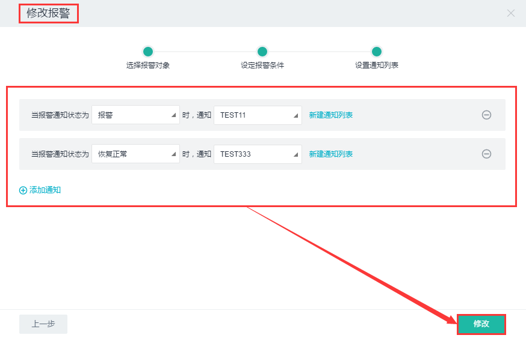

## 3.4 监控报警服务

UOS云平台提供实例监控报警功能。它使用多种先进技术，当检测到实例异常时，能够及时发送短信或邮件通知用户，让用户高枕无忧。

### 3.4.1 报警

#### 1. 核心概念

* **监控项**：即用户设置或者系统默认的监控数据类型，包含CPU使用率、内存使用率、磁盘读速率、磁盘写速率等。

* **规则**：规则是一个条件，在创建报警项时设定，比如“CPU使用率 >= 30%”是一个规则。

* **报警**：即通过设定报警项及报警状态对监控项进行监控，由事件驱动的一个通知动作，通过特定形式通知报警联系人。

#### 2. 相关操作

目前对监控报警的操作支持如下：

* __创建报警__ 

单击二级导航栏“报警”->单击“创建报警”按钮，按照弹框中所示步骤操作：

    选择报警对象：选择资源类型与监控项，再选择监控时间段。选择完成后点击下一步。

  

     设定报警条件：填写报警项名称，设定规则、连续周期数、统计值类型信息，填写信息完成后点击下一步。

  

     设置通知列表：选择报警通知状态（包括报警、恢复正常、数据不足），再选择通知列表。如果没有所需通知列表，可以点击“新建通知列表”创建通知列表，具体创建方式详见操作“创建通知列表”。同时，通过点击“添加通知”，选择不同报警通知状态或者不同通知列表，设置多个报警通知。最后点击创建，便可成功创建一个报警项。

  

     创建完成后，可查看该监控报警以及历史记录。
     
  

  
   

* __启用报警__ 

单击二级导航栏“报警”->选中处于“未开启”状态的报警名称前的复选框，单击“启用报警”按钮，即可启用当前报警。

* __禁用报警__ 

单击二级导航栏“报警”->选中一项启用状态为“已开启”的报警名称前的复选框，单击“禁用报警”按钮，即可禁用当前报警。

* __挂载报警通知__ 

单击二级导航栏“报警” -> 选中一项报警，在详细信息页面单击“挂载报警通知”按钮，在弹框中选择触发状态和通知列表，单击”添加“，即可成功挂载报警通知。

* __修改报警__ 

单击二级导航栏“报警”->选中报警名称前的复选框 -> 单击“更多”按钮 -> 单击”修改报警“。在弹出框中修改报警信息->单击“下一步”按钮 -> 修改通知列表信息 -> 单击”修改“按钮，即可修改报警信息。

* __删除报警__ 

单击二级导航栏“报警”->选中报警名称前的复选框 -> 单击“更多”按钮 -> 单击”删除报警“。在弹出框中单击”删除“按钮，即可删除报警。

### 3.4.2 通知列表

#### 1. 核心概念

* **通知列表**：即报警消息的接收人，包含手机和邮件。

#### 2. 相关操作

目前对通知列表的操作支持如下：

* __创建通知列表__ 

单击二级导航栏“通知列表”-> 单击”创建通知列表“按钮。在弹出框中填写通知列表信息：

    名称：填写通知列表名称，名称为必填选项。
    详细信息： 填写通知列表的详细信息，该项为选填项。
    终端：填写终端。终端包括邮箱和手机两个选项。当选中终端复选框时，终端信息为必填项。终端的添加还可以在通知列表详情页 -> 单击"添加终端"按钮。添加终端信息时要注意，当手机和邮箱通过验证后才能收到报警通知。信息填写完成后，单击“创建”按钮，即可成功创建通知列表。

 

* __更新通知列表__ 

单击二级导航栏“通知列表”->选中通知列表名称前的复选框，单击“更新通知列表”按钮，在弹出框中修改通知列表信息，单击“更新”按钮，即可成功更新通知列表信息。

* __删除通知列表__ 

单击二级导航栏“通知列表” -> 选中通知列表名称前的复选框，单击“删除”按钮，在弹框中确认您要删除的通知列表信息，单击”删除“，即可成功删除当前通知列表项。

* __添加终端__ 

单击二级导航栏“通知列表” -> 选中一项通知列表，在详细信息页面单击“添加终端”按钮，在弹框中确认您要添加的终端信息，单击”添加“，即可成功添加终端。

