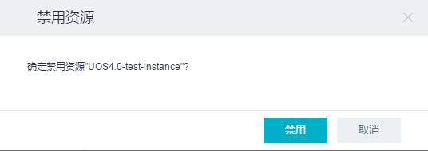

3.2 网络服务
------------

UOS网络服务是基于OpenStack
Neutron项目架构的，用于在云平台上快速建立传统数据中心所需的网络基础设施，例如路由器、公网IP、子网等服务，真正实现软件定义网络SDN。

网络是OpenStack所管理的最重要的资源之一。云主机实现了OpenStack虚拟机世界的抽象，而网络的实现使得各独立的虚拟机之间可以互相通信，它能够为同一物理网络上的每个租户提供独立的虚拟网络环境。

服务性能与限制
^^^^^^^^^^^^^^

-  除了ARP/DHCP，不支持其它类型的广播或组播协议；
-  暂不支持IPv6。

3.2.1 网络拓扑
~~~~~~~~~~~~~~

1. 核心概念
^^^^^^^^^^^

**网络拓扑（Topology）**\ ：网络拓扑是能够反映当前网络结构的拓扑图。

2. 相关操作
^^^^^^^^^^^

目前对网络拓扑的操作支持如下：

-  **查看网络拓扑图**

单击二级导航栏“网络拓扑”，即可查看网络拓扑图。

3.2.2 网络
~~~~~~~~~~

1. 核心概念
^^^^^^^^^^^

**网络（Network）**\ ：指针对云主机的虚拟网卡所在的二层广播域。

**私有网络（Network）**\ ：私有网络是一个隔离的二层广播域，在这个二层网络中，可以创建多个三层网络，即子网。在网络服务中，私有网络主要作为子网容器。

**子网（Subnet）**\ ：子网是私有网络中的一个三层网络，每个子网都有一个CIDR格式的私有网络IP地址段。属于同一个私有网络的子网IP段不能重叠，不同的私有网络可以创建IP地址段相同或重叠的子网。

-  *子网网关*\ ：是子网的网关地址，当子网关联路由器后，会将子网的第一个IP地址作为子网网关，并通过DHCP服务广播网关地址推送到云主机，成为云主机默认网关。

-  *DHCP服务*\ ：DHCP（Dynamic Host Configuration
   Protocol，动态主机设置协议），主要用于内部网络或网络服务供应商自动分配IP地址给用户。创建子网时，默认均开启了DHCP服务，在该子网内创建的云主机都将收到子网DHCP服务器发送的IP地址配置信息，比如IP地址、默认网关等信息。

2. 相关操作
^^^^^^^^^^^

目前对网络的操作支持如下：

-  **创建私有网络**

单击二级导航栏“网络”->在“网络”页面单击“创建私有网络”->在弹出框的文本框中输入私有网络的名称，可以选择“Vlan网络”、“开启安全限制（设置后不能更改）”和“创建子网”前的复选框。若选择“创建子网”，则在“子网”的文本框中给出子网的名称，在“网络地址”的文本框中填写子网的网络地址->单击“创建按钮”即可创建一个私有网络。

.. figure:: ../../img/Project/Network/创建私有网络.png
   :alt: 

-  **删除私有网络**

单击二级导航栏“网络”，选中私有网络名称前的复选框，单击“删除”按钮即可删除私有网络。

-  **创建子网**

单击二级导航栏“网络”，选中私有网络名称前的复选框，单击“创建子网”按钮->在弹出框中的“子网名称”文本框中输入子网的名称。单击“选择私有网络”，在下拉框中选择需要创建子网的私有网络。在“网络地址”的文本框中填写子网的网络地址，单击“创建”按钮即可创建一个子网。若需要使用到子网的高级设置，选中“显示高级选项”前的复选框。若选择“开启网关”，可以在“网关地址栏”文本框中输入网关地址，如不填，系统将自动生成。这个地址可以被用于该私有网络内其他主机的缺省网关。选择“开启DHCP服务”前的复选框，在“DNSx”文本框中输入解析名称，即可推送云主机的name
server。

-  **连接路由器**

单击二级导航栏“网络”->在“子网”页面选中没有绑定路由器的子网名称前的复选框，单击“连接路由器”按钮->在弹出框中选择路由器，点击“连接”按钮即可连接路由器。

-  **断开路由器**

单击二级导航栏“网络”->在“子网”页面选中绑定了路由器的子网名称前的复选框，单击“断开路由器”按钮->在弹出框中点击“断开”按钮即可断开路由器。

-  **添加云主机**

单击二级导航栏“网络”->在“子网”页面选中子网名称前的复选框，单击“更多”按钮->在下拉框中单击“添加云主机”按钮->在弹出框中选择云主机，点击“挂载”按钮即可添加云主机。

-  **修改子网**

单击二级导航栏“网络”->在“子网”页面选中子网名称前的复选框，单击“更多”按钮->在下拉框中单击“修改子网”按钮->在弹出框中可修改子网名称，开启/关闭网关，网关地址，开启/关闭DHCP，DNSx，点击“修改”按钮即可修改子网。

-  **添加网络端口**

单击二级导航栏“网络”->在“子网”页面选中子网，在详细信息中单击“添加网络端口”按钮->在弹出框中输入名称，选择子网，输入IP地址（如不填系统会自动分配），选择安全组，点击“创建”按钮即可添加网络端口。

-  **删除子网**

单击二级导航栏“网络”->在“子网”页面选中子网名称前的复选框，单击“更多”按钮->在下拉框中单击“删除”按钮->在弹出框中选择“删除”按钮即可删除子网。

3.2.3 公网IP
~~~~~~~~~~~~

1. 核心概念
^^^^^^^^^^^

**公网IP（Floating
IP）**\ ：公网IP为云主机和路由器提供全球可直接访问的互联网地址，可以绑定到云主机的某个虚拟网卡，也可以直接绑定到路由器上，为路由器及挂载在路由器上的子网提供公网接入。

2. 相关操作
^^^^^^^^^^^

目前对公网IP的操作支持如下：

-  **申请公网IP**

单击二级导航栏“公网IP”->单击“申请公网IP”按钮，在弹出框中单击“申请”按钮即可快速申请一个公网IP。

-  **（公网IP）绑定到云主机**

单击二级导航栏“公网IP”->选中未使用的“IP地址”前的复选框，单击“绑定到云主机”按钮，在弹出框中单击“云主机”，在下拉框中选择云主机（没有网络端口的云主机不会显示在列表中），单击“网络端口”，在下拉框中选择云主机的网络端口->单击“绑定”按钮即可将公网IP绑定到云主机。

-  **解绑公网IP**

单击二级导航栏“公网IP”->选中被绑定的公网IP“IP地址”前的复选框，单击“更多”->
”单击“解绑”按钮，在弹出框中单击“解绑”按钮即可将公网IP从云主机上解绑。

-  **释放公网IP**

单击二级导航栏“公网IP”->选中“IP地址”前的复选框，单击“释放”按钮，在弹出框中单击“释放”按钮即可将公网IP释放掉。但是不能删除已经绑定资源的公网IP。

-  **（公网IP）绑定到负载均衡**

单击二级导航栏“公网IP”->选中未使用的“IP地址”前的复选框，单击“更多”->
单击“绑定到负载均衡”按钮，在弹出框中单击“负载均衡”，在下拉框中选择负载均衡（负载均衡器所在网络必须能够连接外网，否则绑定公网ip可能不成功。），单击“网络端口”，在下拉框中选择云主机的网络端口->单击“绑定”按钮即可将公网IP绑定到负载均衡。

3.2.4 路由器
~~~~~~~~~~~~

1. 核心概念
^^^^^^^^^^^

**路由器（Router）**\ ：路由器的功能主要有两个：一个是作为公网与用户私有网络之间的通道；二是作为用户多个私有网络之间路由功能。

默认情况下，只要子网关联在同一个路由器上，多个子网之间便自动打通了三层路由，即使不在同一网段的子网，也可互相通信。

-  ***公网网关***\ ：公网网关是私有网络内部与外部公网网络之间的通道，如路由器禁用和启用公网网关效果如下：
-  禁用公网网关，路由器及相连的子网与外部互联网断开，不允许给该路由器绑定公网IP地址，也不允许给路由器相连的子网端口绑定公网IP地址；
-  启用公网网关，并且绑定公网IP之后，路由器及相连的子网才可以与外部互联网通信。
-  ***端口转发***\ ：端口转发是指将针对路由器公网IP地址的某个端口的请求转发到子网的某个云主机IP地址上，而不需要给每个云主机均绑定公网IP来访问，避免将VDC子网主机完全暴露在公网中。
-  ***IPsec隧道***\ ：当用户拥有自己的数据中心或者在多个Region部署云时，一个比较常见的需求就是通过隧道或其他方式允许多个路由器之间完成连接。常见的隧道服务有
   IP in IP、GRE、PPP、PPTP、IPSec
   等。目前咱们云平台实现的是IPsec隧道服务。\ **IPSec**
   并不是一个独立的协议，而是应用于IP层上网络数据安全的一整套体系结构，所以其概念和配置很复杂。IPSec
   提供了两种安全机制：认证（Authentication）和加密（Encryption），还有两种封装模式：隧道（Tunnel）和传输（Transport），前者通常用于架设在路由器上连接不同网络，后者通常用于主机到主机或主机到路由器。一般来说，IPSec
   是不支持组播和广播，所以在工程实践常使用 GRE Over IPSec。

2. 相关操作
^^^^^^^^^^^

目前对路由器的操作支持如下：

-  **创建路由器**

单击二级导航栏“路由器”->单击“创建路由器”按钮，在弹出框中的“名称”文本框中输入路由器名称，即可快速创建一个路由器。可以选中“开启公网网关”前的复选框开启公网网关，允许私有网络内部与外部公网网络之间通信，否则不可通信。

-  **启用/禁用公网网关**

单击二级导航栏“路由器”，选中路由器名称前的复选框-> 单击“更多”->
单击“启用/禁用公网网关”按钮，在弹出框中点击“启用/禁用”按钮。

-  **连接子网**

单击二级导航栏“路由器”，选中路由器名称前的复选框-> 单击“更多”->
单击“连接子网”按钮，在弹出框中选择子网，点击“关联”按钮即可连接子网。

-  **添加端口转发**

单击二级导航栏“路由器”，选中一个路由器弹出详细信息页->点击“端口转发”标签，单击“添加端口转发”按钮->在弹出框中的文本框填写相关信息：选择TCP或UDP协议，填写源端口（请输入端口号，推荐使用1024以上的端口，避免与其他服务冲突。），选择目标IP，填写目标端口（请输入云主机内部服务端口，比如SSH服务的22端口。）->单击“创建”按钮即可创建一个端口转发。

-  **创建隧道**

单击二级导航栏“路由器”，选中一个路由器弹出详细信息页->点击“IPsec隧道”页，单击“创建隧道”按钮->在弹出框中的文本框填写相关信息：“名称”文本框中输入隧道名称，选择IKE策略（如若没有IKE策略则单击右侧“创建”按钮，填写相关信息，点击创建按钮即可），选择IPSec策略（如若没有，同IKE策略），选择VPN服务（如若没有VPN服务，单击右侧“创建”按钮，填写名称，选择子网，点击创建按钮即可），填写远端IP（请填写对端路由的IP地址，须为合法的IP地址，例如1.2.3.4），密钥，填写目标网络（请填写对端路由器的IP地址，例如192.168.0.4/24
目标网络不能和本路由器已有的私有网络重复），保存目标网络，点击“创建”按钮即可创建一个IPsec隧道。对端路由器的IPSec隧道创建与上面一致。

-  **编辑隧道**

单击二级导航栏“路由器”，选中一个路由器弹出详细信息页->点击“IPsec隧道”页，单击“编辑”按钮->在弹出框中修改需要更改的信息，包括名称、远端IP、密钥和目标网络。->单击“更新”按钮。

-  **删除隧道**

单击二级导航栏“路由器”，选中一个路由器弹出详细信息页->点击“IPsec隧道”页，单击“删除”按钮即可删除隧道。

-  **删除路由器**

单击二级导航栏“路由器”，选中路由器名称前的复选框->单击“更多”按钮->单击“删除”按钮，若路由器有子网关联，则不能删除，需先解绑子网；若路由器无子网关联，则可直接删除。

3.2.5 网络端口
~~~~~~~~~~~~~~

1. 核心概念
^^^^^^^^^^^

**网络端口（Port）**\ ：网络端口port是OpenStack网络中重要的概念，它代表了虚拟交换机上的一个虚拟交换端口，记录其属于哪个网络以及对应的IP等信息。当一个port被创建时，默认情况下，会为它分配其指定subnet中可用的IP。当我们创建虚拟机时，可以为其指定一个port。

2. 相关操作
^^^^^^^^^^^

目前对网络端口的操作支持如下：

-  **创建网络端口**

单击二级导航栏“网络端口”->单击“创建网络端口”，在弹出框中的“名称”文本框中输入网络端口名称。单击“子网”，在下拉列表中选择网络端口所在的子网，“IP地址”文本框可以选择输入或不输入。若不输入则系统会自动分配。选择“安全组”中合适的安全组规则->单击“创建”按钮即可创建一个网络端口。

-  **删除网络端口**

单击二级导航栏“网络端口”->选中端口名称前的复选框，单击“更多”按钮，在弹出框中选择“删除”按钮->在弹出框中点击“删除”按钮即可删除网络端口。但是仅能删除未关联资源的或关联资源是云主机的网络端口，关联资源是路由器或DHCP服务的网络端口不可直接删除。关联资源是路由器的网络需先将路由器与子网解除关联，再删除其网络端口。

-  **（网络端口）绑定到云主机**

单击二级导航栏“网络端口”->选中新建的未使用的网络端口名称前的复选框，单击“绑定到云主机”->单击弹出框中的“云主机”，在下拉列表中选择云主机->单击“绑定”按钮即可给云主机添加网络端口。

-  **（网络端口）从云主机卸载**

单击二级导航栏“网络端口”->选中关联资源为云主机的网络端口名称前的复选框，单击“从云主机卸载”，在弹出框中单击“卸载”按钮即可删除云主机的网络端口。

-  **（网络端口）修改安全组**

单击二级导航栏“网络端口”->选中端口名称前的复选框，单击“更多”->
单击“修改安全组”按钮，在弹出框中选择安全组->点击“修改”按钮即可修改安全组。

3.2.6 安全组
~~~~~~~~~~~~

1. 核心概念
^^^^^^^^^^^

**安全组（Security
Group）**\ ：指针对云主机的虚拟网卡的安全策略，也用于将多个虚拟网卡归类为一个组。安全组在计算实例中扮演着虚拟防火墙的角色，控制出入的流量。它在端口层面而不是子网层面，因此，子网中的每个端口都要被指定不同的安全组集合。如果在启动时没有指定特殊的安全组，实例会自动给该网络分配一个默认的安全组。安全组集合和安全组规则使得管理员和租户可以自己选择通过端口的流量类型和出入的方向。一个安全组是安全组规则的容器，当端口被创建，它就被分配了一个默认的安全组，且默认情况下，该安全组下行规则无允许通过的流量类型但是上行规则允许通过所有的流量类型。但是，若要改变这一行为，只需要将某些规则加进这个安全组。

***备注**\ ：* >
*与一般的云平台不同，这里的安全组作为一个防火墙针对的是某一个虚拟网卡，而不是一个云主机，云主机如果有多个虚拟网卡，可以针对每个虚拟网卡来设置安全组，更加细粒度控制安全。*

2. 相关操作
^^^^^^^^^^^

目前对安全组的操作支持如下：

-  **创建安全组**

单击二级导航栏“安全组”->单击“创建安全组”按钮，在弹出框中的“名称”文本框中输入安全组名称，可以选择在“描述”文本框中输入对安全组的描述，也可不输入->单击“创建”按钮即可创建一个新的安全组。

-  **修改安全组**

单击二级导航栏“安全组”->选中新创建的安全组名称前的复选框，单击“修改安全组”。在弹出框中修改安全组名称和描述，单击“修改”按钮即可修改安全组规则。但是默认的安全组不允许修改。

-  **删除安全组**

单击二级导航栏“安全组”->
选中新创建的安全组名称前的复选框，单击“删除”按钮即可快速删除安全组。也可批量同时删除几个安全组。同样，系统默认的安全组规则不可删除。

-  **添加（上行/下行）安全组规则**

单击二级导航栏“安全组”->
单击新创建的安全组名称->在“详细信息”页面中看到“下行/上行”和“添加安全组规则”按钮。如需添加下行组规则，单击“下行”按钮
->单击“添加安全组规则”按钮，在弹出框中选择“规则”、“协议”以及“目标”，单击“创建”按钮即可添加下行安全组。如需添加上行安全组规则，同上行规则一样即可创建上行安全组规则。

-  **删除（上行/下行）安全组规则**

单击二级导航栏“安全组”->
单击新创建的安全组名称->在“详细信息”页面中的“操作”栏目中点击“x”即可删除规则。

***备注**\ ：*

    -  ***下行安全组规则***
       *是指从外部（公网或者其他云主机）访问云主机的白名单规则，即只允许满足以下规则的流量通过。默认不允许任何协议的流量通过。*
    -  ***上行安全组规则***
       *是指从云主机内部访问外部（公网或者其他云主机）的白名单规则，即只允许满足以下规则的流量通过。默认允许所有协议流量通过。*
    -  ***为了能够实现云主机的远程SSH登录***\ ，\ *我们需要创建安全组的下行规则（从外部访问云主机）。由于默认的下行安全组规则不允许任何流量通过，故需要手动创建满足SSH登陆的条件。SSH是一种网络协议，用于计算机之间的加密登陆。\ **SSH的默认端口是22，也就是说，从远程登录时的登录请求会送到远程主机的22端口。点击安全组后，选择下行的“添加安全组规则”，规则选择HTTP，协议为TCP协议，端口范围为22，目标选择任意即可实现符合SSH登录的端口条件**\ 。*

使用SSH登录，详见“\ `2.1
快速创建云主机 <../快速入门/快速创建云主机.md>`__\ ”

3.2.7 负载均衡
~~~~~~~~~~~~~~

1. 核心概念
^^^^^^^^^^^

**负载均衡(Load Balancing)**:
为了提高用户服务的\ **可用性**\ 和\ **可扩展性**\ ，UOS云平台提供了基于TCP/HTTP的负载均衡服务（Load
Balancing
Service，LBS），可以避免用户投入虚拟机和人力的成本过高，让用户不担心负载均衡（Load
Balancer，LB）的单点问题，且可直接通过API调用自动化操作。

::

    LBS的工作原理为: 当客户端发起访问请求时，负载均衡器通过轮询、最小连接数或源IP对的方式，将用户请求转发至适合处理请求的服务器上进行请求处理。

UOS云平台的LBS是在多台云主机间实现基于TCP/HTTP的应用程序流量的自动分配，通过监听器响应向客户端请求，将请求平均分配到服务器资源池，并支持自动检测并隔离不可用的主机，解决大量并发访问服务问题，实现故障自动切换，提高业务可用性及资源利用率。LBS通过\ **负载均衡器**\ 和\ **资源池**\ 两个模块，为云主机提供\ **高可用**\ 、\ **高性能**\ 及\ **高安全**\ 的业务保障。

-  **负载均衡业务逻辑**

   UOS的LBS业务遵从下列业务逻辑：

       1. 如果客户访问的是公网IP，会首先进行公网/内网IP的NAT（Network
          Address
          Translation，网络地址转换），如果直接访问内网IP则略过此步骤；
       2. 负载均衡器在收到客户的访问后，根据被访问的端口确认将该业务分配给哪个监听器；
       3. 监听器会选择默认资源池，决定将该访问请求转发到某个资源池；
       4. 资源池定期检查后端业务服务器的功能是否正常，在确认业务服务器正常的情况下会按照调度策略将访问请求发给业务服务器。

-  **负载均衡器**

负载均衡器是业务负载的调度控制器，主要承载LBS业务的网络和监听器，用于制定业务的负载均衡策略。

-  **负载均衡网络**

负载均衡网络即LBS业务的网络配置，负载LBS业务的网络和安全。LBS业务支持私有网络，创建LB时，可根据需要选取所在的私有网络。注意，\ **LB所关联的资源池必须和LB属于同一个网络或子网**\ 。

-  **LBS私有网络**

创建LB时加入私有网络的前提是必须先创建一个私有网络或子网。当创建LB选择私有网络及相应的子网后，LB会自动加入该私有网络中
，并自动为LB分配一个该子网的IP地址，作为LBS业务的服务地址，该IP地址无法修改。加入私有网络的LB需要提供公网IP的LBS时，需满足：

::

    > 1. 提前在云平台申请一台路由器，并开启公网网关；
    > 2. 将LB加入的子网关联至路由器；
    > 3. 绑定公网IP至负载均衡器（也可将公网IP绑定至路由器，但需要在路由器上做端口转发实现负载均衡业务）

-  **监听器**

监听器（Listener）主要承载LBS业务的监听服务，包括监听协议、端口、最大连接数及关联资源池。一个负载均衡器可以创建多个Listener，每个Listener对应一个应用负载均衡服务。

-  **监听器配置参数**

创建监听器时需要指定监听协议、端口及最大连接数，其中：

::

    * 监听协议是指LBS业务的网络协议，UOS云平台LBS业务仅提供TCP和HTTP协议的负载均衡；
    * 端口是指LBS业务对外或对内提供服务时用来接收请求并向资源池服务器进行请求转发的应用端口，同一个LB内不同监听器的端口不重复；
    * 最大连接数是指该LBS业务的网络的并发连接数，当超过设置的连接数时，LBS会拒绝该请求。

-  **资源池**

资源池是LBS业务的承载体，即由多个云主机组成服务器群组，负责接受并处理LB的监听器分发的请求，LBS按照用户制定的监听规则，将用户的请求转发至资源池的一台云主机进行业务处理。同一个资源池所有云主机提供相同的协议和端口，且提供相同的业务。资源池由多个组件配合使用，包括资源池网络健康检查策略及资源列表等。

-  **资源池的网络**

资源池网络是指该云主机群组加入的网络，具体规则为：

::

    * **资源池的网络和协议必须和监听器所在的负载均衡服务器属于同一网络或子网，否则监听器无法关联资源池**；
    * **若监听器在私有网络的一个子网，资源池也必须加入该子网**；
    * **若监听器支持的协议为TCP，资源池的协议也必须为TCP**。

-  **负载均衡策略**

负载均衡策略即LBS业务负载方式，即通过负载策略将LBS业务请求以不同的方式转发至资源池云主机处理。具体包括轮询、最小连接数及源IP三种方式。

::

    * **轮询**    

    轮询是指将LBS业务的请求依序分发给资源池里的云主机进行处理，而不关心连接数和宽带等指标。当LBS业务请求通过负载均衡器的监听器转发至资源池时，请求将会依次发送给资源池里的云主机进行处理。在轮询模式下，业务负载基本为平均分配。

    * **最小连接数**    

    最小连接数模式是将LBS业务的请求分发给当前连接最小的一台云主机处理。当LBS业务的请求通过负载均衡器的监听器转发至资源池时，请求将会发送给资源池里当前连接数最小的云主机来处理，在最小连接数模式下，业务负载不均衡，业务的请求被合理的分发给资源池的云主机。

    * **源IP**     

    源IP负载模式是将源于同一个源IP的请求分发给资源池里的同一台云主机处理。当LBS业务的请求通过负载均衡器的监听器转发至资源池时，LBS将根据client的IP地址将同一源IP的请求分发至同一台云主机处理。

-  **健康检查策略**

健康检查策略是指当资源池里某台云主机的网络或应用发生故障时，LBS将请求转发至其它健康正常的云主机上。当故障云主机恢复正常时，健康检查策略会将其自动恢复LBS业务，请求会通过负载均衡策略转发至该云主机。健康检查策略支持TCP和HTTP两种方式，同时健康检查策略还支持对检查间隔时间、超时限制和尝试次数的配置，用于更好的控制健康检查策略。

::

    * **TCP检查方式**    

    当资源池云主机提供的服务为TCP服务时，LBS可提供基于TCP的健康检查方式。由LBS业务向资源池里的每台云主机发起基于该端口的TCP请求，若TCP端口可以畅通，该云主机将持续提供服务；若TCP端口不通，则LBS将业务调度到其它云主机，直到该台云主机TCP端口恢复正常，方可提供业务服务。

    * **HTTP检查方式**    

    当资源池云主机提供的服务为HTTP服务时，LBS可提供基于HTTP的URL健康检查方式。LBS通过资源池所在的子网的IP地址向云主机HTTP服务URL地址发起GET请求，若返回代码为200 OK，则视为该云主机运行正常，否则视为云主机异常；若云主机异常，LBS将业务调度至其它云主机，直到该台云主机HTTP返回200 OK，代表该云主机恢复正常。

-  **健康检查选项**

   -  检查时间间隔，即每隔多长时间执行一次健康检查；
   -  超时限制，即检查业务的超时时间；
   -  尝试次数，即检查超时后，尝试检查的次数。

-  **资源列表**

资源列表为资源池的云主机群组，即LBS业务的实际服务提供者。资源列表和该资源池必须属于同一网络或子网，非同一子网的云主机，无法添加至该资源池。资源列表通过云主机名称、云主机内网IP地址、业务端口号及权重进行资源添加。云主机的端口号必须为提供业务服务的端口，且监听器监听的端口和此端口必须一致；权重是指资源池里云主机的优先级，权重值越高，云主机将会被分配到更多的访问请求，可根据云主机提供服务的能力进行设定。

-  **LBS的应用场景**

   -  高性能、高并发、高扩展的应用系统，如WEB Server和App Server；
   -  对主备、集群有需求的应用系统，当某一节点发生故障时，应用服务仍可正常提供服务；
   -  提供同一种协议，同一种服务的服务器集群系统。

2. 相关操作
^^^^^^^^^^^

目前对负载均衡的操作支持如下：

-  **创建负载均衡器**

单击二级导航栏“负载均衡”->单击“创建负载均衡器”按钮，在弹出窗中的“名称”文本框中输入负载均衡器名称，选择子网即可快速创建一个负载均衡器。

-  **修改负载均衡器**

单击二级导航栏“负载均衡”->选中负载均衡器名称前的复选框，单击“更多”->单击“修改”按钮，在弹出窗中的“名称”文本框中输入修改的负载均衡器名称，点击“修改”按钮即可修改负载均衡器。

-  **绑定公网IP**

单击二级导航栏“负载均衡”->选中负载均衡器名称前的复选框，单击“更多”->单击“绑定公网IP”按钮，在弹出窗中选择要绑定的公网IP，点击“绑定”按钮即可绑定公网IP。

-  **解绑公网IP**

单击二级导航栏“负载均衡”->选中负载均衡器名称前的复选框，单击“更多”->单击“解绑公网IP”按钮，在弹出窗中点击“解绑”按钮即可解绑公网IP。

-  **删除负载均衡器**

单击二级导航栏“负载均衡”，选中负载均衡器名称前的复选框->单击“更多”按钮->单击“删除”按钮，若有监听器正在使用该负载均衡器，则不能删除，删除报错；若没有监听器正在使用该负载均衡器，则可直接删除。

-  **创建监听器**

单击二级导航栏“负载均衡”，选中一个负载均衡器弹出详细信息页->点击“监听器”页，单击“创建监听器”按钮->在弹出框中的文本框填写相关信息：“名称”文本框中输入监听器名称，选择监听协议（TCP或HTTP），输入监听端口（端口范围：1\ :sub:`65535），选择最大连接数（10000`\ 40000），单击“创建”按钮即可创建一个监听器。

-  **修改监听器**

单击二级导航栏“负载均衡”，选中一个负载均衡器弹出详细信息页->点击“监听器”页，单击“修改监听器”按钮->在弹出框中修改需要更改的信息，包括名称和最大连接数。->单击“修改”按钮。

-  **启用/禁用监听器**

单击二级导航栏“负载均衡”，选中一个负载均衡器弹出详细信息页->点击“监听器”页，单击“更多”按钮->单击“启用/禁用”按钮即可。

-  **删除监听器**

单击二级导航栏“负载均衡”，选中一个负载均衡器弹出详细信息页->点击“监听器”页，单击“更多”按钮->单击“删除”按钮，若有资源池正在使用该监听器，则不能删除，删除报错；若没有资源池正在使用该监听器，则可直接删除。

-  **创建资源池**

单击二级导航栏“负载均衡”，切换至资源池页面->单击“创建资源池”按钮->在弹出框中填写相关信息：名称、协议（TCP和HTTP）、监听器（与协议相对应）和负载方式（轮询、最小连接数、源IP），单击“创建”按钮。

-  **修改资源池**

单击二级导航栏“负载均衡”，切换至资源池页面->选中需要修改的资源池名称前的复选框，单击“更多”按钮->单击“修改资源池”按钮->在弹出框中修改需要更改的信息，包括名称和负载方式（轮询、最小连接数、源IP），单击“修改”按钮。

-  **删除资源池**

单击二级导航栏“负载均衡”，切换至资源池页面->选中需要删除的资源池名称前的复选框，单击“更多”按钮->单击“删除资源池”按钮即可删除资源池。

-  **创建健康检查**

单击二级导航栏“负载均衡”，切换至资源池页面->单击“创建健康检查”按钮->在弹出框中填写相关信息：选择资源池、探针类型（TCP和HTTP）、间隔时间（范围：2\ :sub:`60秒）、超时限制（范围：5`\ 300秒）和尝试次数（范围：1~10次），单击“创建”按钮。

-  **修改健康检查**

单击二级导航栏“负载均衡”，切换至资源池页面->选中需要修改健康检查的资源池名称前的复选框，单击“更多”按钮->单击“修改健康检查”按钮->在弹出框中修改需要更改的信息，包括名称和负载方式（轮询、最小连接数、源IP），单击“修改”按钮。

-  **删除健康检查**

单击二级导航栏“负载均衡”，切换至资源池页面->选中需要删除健康检查的资源池名称前的复选框，单击“更多”按钮->单击“删除健康检查”按钮即可删除该资源池的健康检查。

-  **添加资源**

单击二级导航栏“负载均衡”，切换至资源池页面->选中一个资源池弹出详细信息页->单击资源列表中的“添加资源”按钮，在弹出框中填写相关信息：选择云主机、内网IP，填写监听端口和权重，点击“添加”按钮即可添加资源。

-  **修改权重**

单击二级导航栏“负载均衡”，切换至资源池页面->选中一个资源池弹出详细信息页->在资源列表中选中需要修改权重的资源名称前的复选框，单击“更多”按钮->单击“修改权重”按钮，在弹出框中修改权重，点击“修改”按钮即可。

-  **启用/禁用资源**

单击二级导航栏“负载均衡”，切换至资源池页面->选中一个资源池弹出详细信息页->在资源列表中选中需要启用/禁用的资源名称前的复选框，单击“更多”按钮->单击“启用资源/禁用资源”按钮。

-  **删除资源**

单击二级导航栏“负载均衡”，切换至资源池页面->选中一个资源池弹出详细信息页->在资源列表中选中需要删除的资源名称前的复选框，单击“更多”按钮->单击“删除”按钮即可删除资源。

