3.1 计算服务
------------

UOS云主机作为云计算中最基础的服务，基于\ **OpenStack
Nova**\ 项目建设，承载了云平台所有服务的计算业务。相比传统物理机而言，UnitedStack云主机具有\ **方便部署、高弹性和灵活**\ 等特性。与传统物理机相同，UOS云主机也可实时添加或删除网卡、硬盘、更改主机CPU/内存等，也可以通过VNC终端在无网络的情况下管理虚拟机。在UOS云平台上，创建或删除一台云主机的时间不超过10秒，并且其\ **计费精确到秒**\ ，真正实现按需计费的需求。

3.1.1 云主机服务
~~~~~~~~~~~~~~~~

1. 核心概念
^^^^^^^^^^^

**云主机（Instance）**\ ，即一台云服务器，通过定制化的镜像，在指定的CPU和内存配置下运行的一台主机，具有一般主机的所有正常功能。

2. 相关操作
^^^^^^^^^^^

目前对云主机的操作支持如下：

-  **创建云主机**

单击二级导航栏“云主机”->单击“创建云主机”
->在弹出框中的文本框输入主机名称，并选择镜像，单击“下一步”按钮进入下一弹出框->单击“配置”，在下拉框中选择CPU类型、内存容量和硬盘容量，单击“折叠”按钮->单击“网络”，在下拉框中选择一个私有网络->单击“安全组”，选择一个安全组，单击“折叠”按钮->若使用密钥对登录，单击“密钥对”，选择所需的密钥；若使用密码登录，单击“密码”，在文本框中输入密码（密码要求必须以数字或字母开头，同时包含大写字母、小写字母、数字，并且长度在8－20位字符之间。）以及确认密码->设置创建的云主机的数量（不得小于1）->单击“创建”按钮。

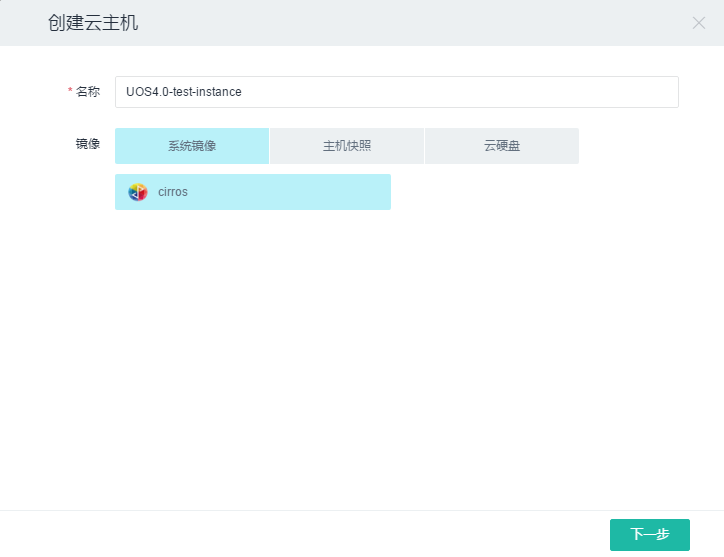

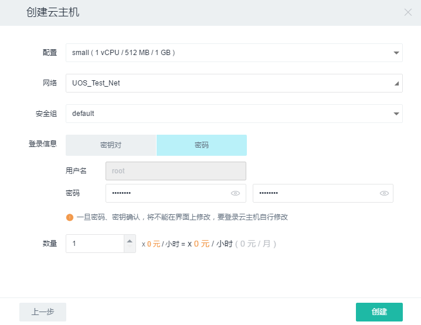

-  **删除云主机**

选择需要删除的云主机前的复选框->单击“更多”按钮->单击“删除”，若云主机处于运行状态，需在弹出框中选取复选框“确认删除正在运行的主机”，点击“删除”按钮；若删除之前先将云主机关机，则单击“删除”按钮，在弹出框中单击“删除”按钮即可删除云主机。

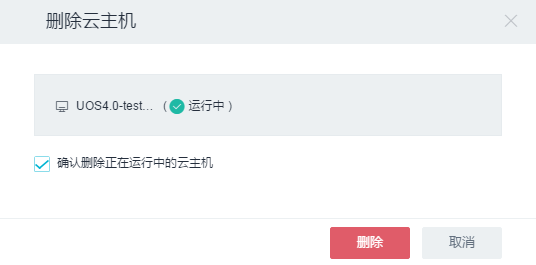

-  **开机/关机/重启**

单击二级导航栏“云主机”，页面上会呈现“开机”和“关机”按钮。若云主机处于开机状态，只需选中云主机名称前的复选框，单击“关机”按钮即可将云主机关机；若云主机处于关机状态，只需选中云主机名称前的复选框，单击“开机”按钮即可将云主机开机；若想重启云主机，选中云主机名称前的复选框，单击“更多”按钮->在下拉菜单中单击“重启”按钮即可实现云主机的重启工作。

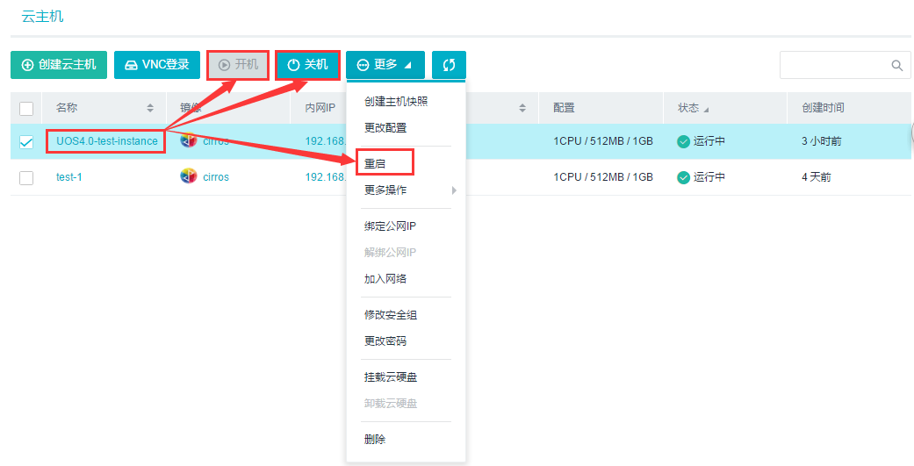

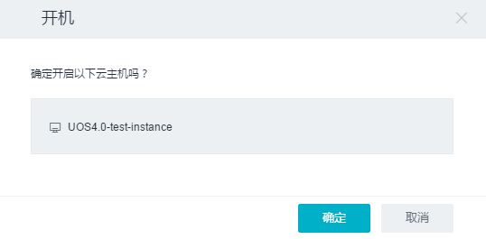

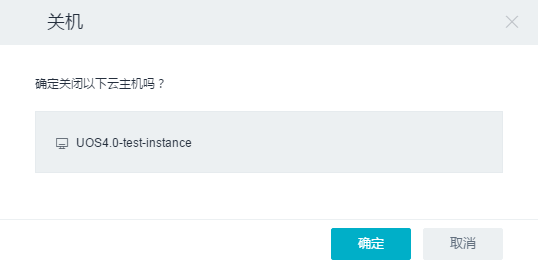

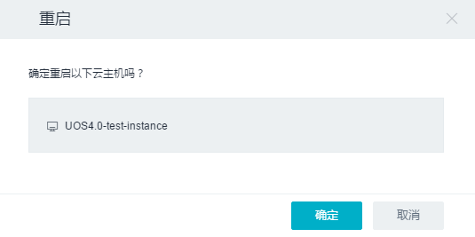

-  **暂停（Pause）/取消暂停（Unpause）云主机**

-  有时需要短时间暂停 instance，可以通过 Pause 操作将 instance
   的状态保存到宿主机的内存中，暂停操作成功执行后，instance 的状态变为
   Paused 。当需要取消暂停的时候，执行 Unpause 操作，从内存中读回
   instance 的状态，然后继续运行 instance。

单击二级导航栏“云主机”，选中云主机名称前的复选框，单击“更多”按钮->单击更多操作中的“暂停云主机”（或“取消暂停云主机”）即可。

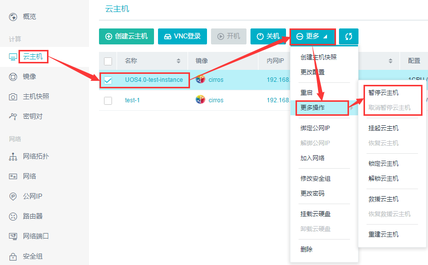

-  **挂起（Suspend）/恢复（Resume）云主机**

-  有时需要长时间暂停 instance，可以通过 Suspend 操作将 instance
   的状态保存到宿主机的磁盘上，挂起操作成功执行后，instance 的状态变为
   Suspended。当需要恢复的时候，执行 Resume 操作，从磁盘读回 instance
   的状态，使之继续运行。

单击二级导航栏“云主机”，选中云主机名称前的复选框，单击“更多”按钮->单击更多操作中的“挂起云主机”（或“恢复云主机”）即可。

-  **锁定（Lock）/解锁（Unlock）云主机**

-  为了避免误操作，比如意外重启或删除instance，可以将instance加锁。对被加锁（Lock）的
   instance
   执行重启等改变状态的操作会提示操作不允许，执行解锁（Unlock）操作后恢复正常。

***备注：***

    *admin 角色的用户不受 lock
    的影响，并且无论加锁与否都可以正常执行操作；*

    *根据默认 policy 的配置，任何用户都可以 unlock，也就是说如果发现
    instance 被加锁了，可以通过 unlock 解锁，然后再执行操作。*

单击二级导航栏“云主机”，选中云主机名称前的复选框，单击“更多”按钮->单击更多操作中的“锁定云主机”（或“解锁云主机”），在弹出框中单击“锁定”（或“解锁”）按钮。

-  **救援（Rescue）/取消救援（Unrescue）/重建（Rebuild）云主机**

-  有时候由于误操作或者突然断电，操作系统重启后却起不来了。为了最大限度挽救数据，我们通常会使用一张系统盘将系统引导起来，然后再尝试恢复。问题如果不太严重，完全可以通过这种方式让系统重新正常工作，比如某个系统文件意外删除，
   root 密码遗忘等。

-  目前提供了\ **Rescue**\ 和\ **Rebuild**\ 这两种故障恢复机制：Rescue
   用指定的 image 作为启动盘引导 instance，将 instance
   本身的系统盘作为第二个磁盘挂载到操作系统上；Rebuild 会用 snapshot
   替换 instance 当前的镜像文件，同时保持 instance
   的其他诸如网络，资源分配属性不变。

单击二级导航栏“云主机”，选中云主机名称前的复选框，单击“更多”按钮->单击更多操作中的“救援云主机”（或“取消救援云主机”或“重建云主机”）即可。

-  **VNC登录**

单击二级导航栏“云主机”->选中云主机名称前的复选框，单击“VNC登录”即可快速管理云主机；或者选中一个云主机弹出详细信息页，点击“VNC登录”。

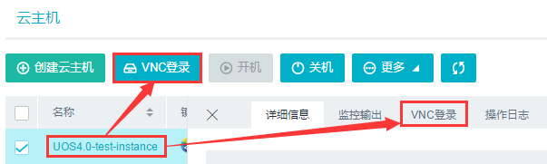

-  **更改配置**

单击二级导航栏“云主机”，选中云主机名称前的复选框，单击“更多”按钮->单击“更改配置”，在弹出框中修改需要更改的配置，包括CPU类型、内存容量和硬盘容量->单击“更改”按钮。

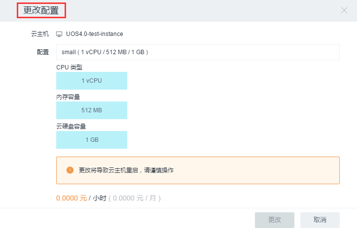

-  **创建主机快照**

单击二级导航栏“云主机”，选中云主机名称前的复选框，单击“更多”按钮->单击“创建主机快照”，在弹出框中输入主机快照的名称->单击“创建”按钮。

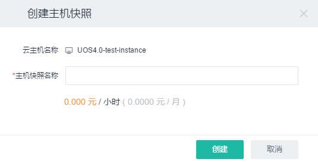

-  **绑定/解绑公网IP**

单击二级导航栏“云主机”，选中云主机名称前的复选框，单击“更多”按钮->若云主机未绑定公网IP，单击“绑定公网IP”，在弹出框中点击“公网IP”，在下拉框中选择公网IP->单击“绑定”按钮即可给云主机绑定公网IP。若云主机已绑定公网IP，单击“解绑公网IP”，在弹出框中单击“解绑”按钮即可解绑公网IP。

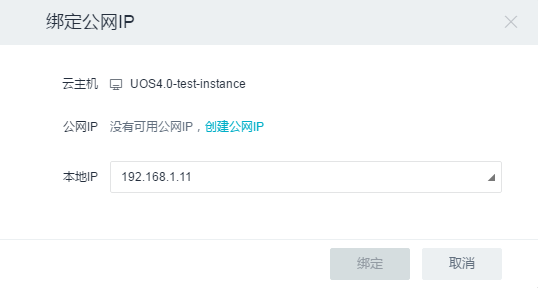

-  **加入网络**

单击二级导航栏“云主机”，选中云主机名称前的复选框，单击“更多”按钮->单击“加入网络”，在弹出框中单击“选择子网”（或“选择网络端口”），在下拉框中选择需要加入的网络（或网络端口）->单击“加入”按钮就可实现云主机加入网络。

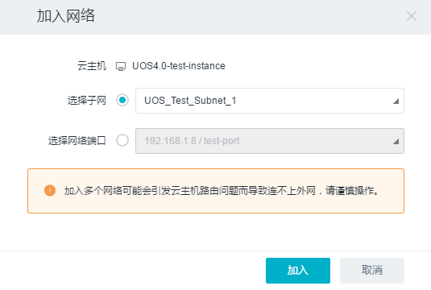

-  **修改安全组**

单击二级导航栏“云主机”，选中云主机名称前的复选框，单击“更多”按钮->单击“修改安全组”，在弹出框中单击“网络端口”，在下拉框中选择需要修改的网络端口。选中需要修改的安全组->单击“保存”按钮即可修改云主机的安全组规则。

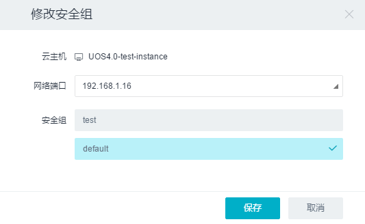

-  **更改密码**

单击二级导航栏“云主机”，选中状态为“运行中”的云主机名称前的复选框，单击“更多”按钮->单击“更改密码”，在弹出框中输入更改的密码以及确认密码->单击“确认”按钮。

-  **挂载云硬盘**

单击二级导航栏“云主机”，选中云主机名称前的复选框，单击“更多”按钮->单击“挂载云硬盘”，在弹出框中选择云硬盘类型，选中需要挂载的云硬盘->单击“挂载”按钮即可将云硬盘挂载到云主机。

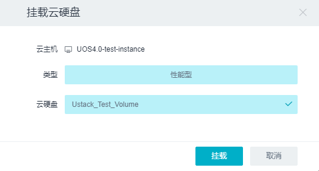

-  **卸载云硬盘**

详见\ `3.3.1 云硬盘 <存储服务.md#3.3.1%20云硬盘>`__\ 。

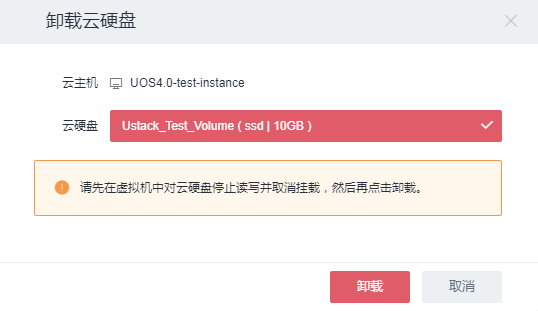

-  **创建报警**

单击二级导航栏“云主机”->选中一个云主机弹出详细信息页->点击“监控”标签，列有该云主机的\ **CPU使用率、内存使用率、磁盘读速率、磁盘写速率、网络端口传入平均速率和网络端口传出平均速率**\ 的图表，单击“创建报警”按钮->在弹出框中填写相关信息（具体创建过程详见\ `3.4.1
报警 <监控报警服务.md#3.4.1%20报警>`__\ ），即可创建该云主机的一个报警，在“报警”标签列出了报警列表。

-  **操作日志**

单击二级导航栏“云主机”->选中一个云主机弹出详细信息页，点击“操作日志”即可查看该云主机的操作日志。

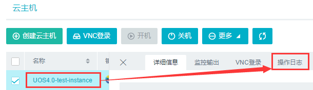

-  **错误消息detail**

单击二级导航栏“云主机”->选中一个状态为“错误”的云主机弹出详细信息页，即可查看该云主机的错误消息。

3.1.2 镜像服务
~~~~~~~~~~~~~~

1. 核心概念
^^^^^^^^^^^

**镜像（Image）**\ ：为了省略操作系统和一些软件的安装步骤，而定制化的满足创建一台云主机所需的资源。

UOS镜像服务，是指云主机所使用的根分区或系统盘，用户可以快速地通过镜像复制出一台云主机来，免除了传统的装机过程。原则上，UOS云平台支持任何虚拟镜像，但为了达到更好的用户体验，我们特意精选常用的发行版，并对此进行一定的优化，免除用户不熟悉的调优操作。

2. 相关操作
^^^^^^^^^^^

目前对镜像的操作支持如下：

-  **创建镜像**

单击二级导航栏“镜像”->单击“创建镜像”
->在弹出框中的“名称”文本框中输入镜像名称，URL框输入镜像链接，单击“创建”按钮即可创建镜像。

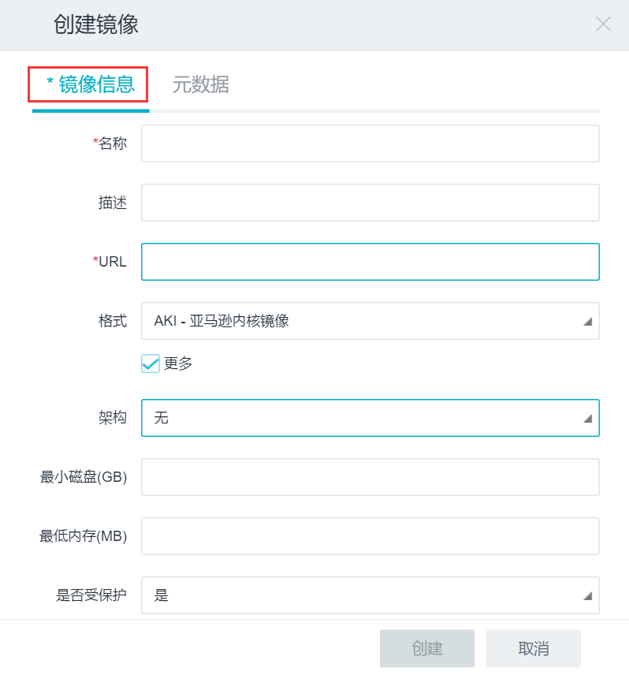

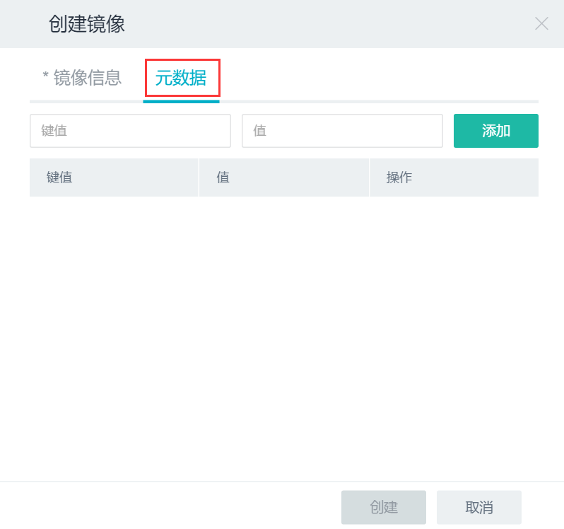

-  **修改镜像**

单击二级导航栏“镜像”->选中镜像名称前的复选框，单击“更多”，单击“修改镜像”
->在弹出框中修改相应信息，单击“修改”按钮即可。

-  **创建云主机**

单击二级导航栏“镜像”->选中镜像名称前的复选框，单击“创建云主机”
->在弹出框中的文本框输入主机名称，并选择系统镜像，单击“下一步”按钮进入下一弹出框->单击“配置”，在下拉框中选择CPU类型、内存容量和硬盘容量，单击“折叠”按钮->单击“网络”，在下拉框中选择一个私有网络->单击“安全组”，选择一个安全组，单击“折叠”按钮->若使用密钥对登录，单击“密钥对”，选择所需的密钥；若使用密码登录，单击“密码”，在文本框中输入密码（密码要求必须以数字或字母开头，同时包含大写字母、小写字母、数字，并且长度在8－20位字符之间。）以及确认密码->设置创建的云主机的数量（不得小于1）->单击“创建”按钮。

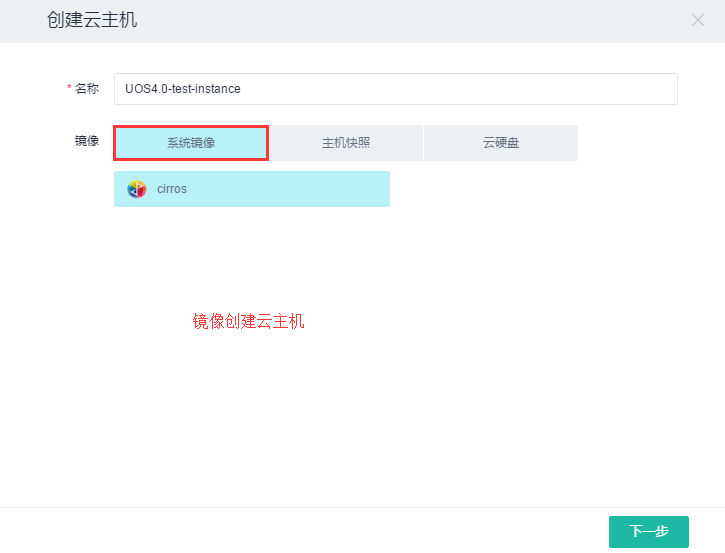

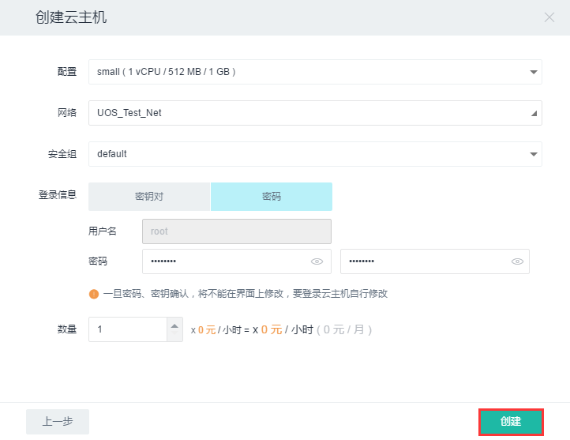

-  **创建云硬盘**

单击二级导航栏“镜像”->选中镜像名称前的复选框，单击“更多”，单击“创建云硬盘”
->在弹出框中的“名称”文本框中输入云硬盘名称，选择类型（性能型、容量型）和容量，单击“创建”按钮即可创建一块云硬盘。

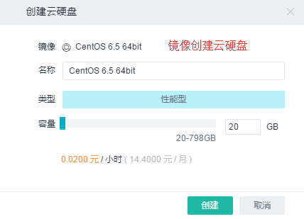

-  **查看镜像关联的云主机列表**

单击二级导航栏“镜像”->选中一个镜像弹出详细信息页->点击“关联云主机”标签。

3.1.3 主机快照服务
~~~~~~~~~~~~~~~~~~

1.核心概念
^^^^^^^^^^

对正在运行或者已经关机的云主机进行快照，可以将根分区/系统盘某个时刻的状态完全保存。这个快照将自己加入镜像仓库，成为“自建镜像”，之后随时可以从这个云主机快照/镜像创建一台新的云主机。

***备注**\ ：* >
*对运行状态的云主机进行快照时，为保证云主机进行数据完整，云主机将被暂停几秒钟，期间网络不可访问，磁盘不可读写。*

2.相关操作
^^^^^^^^^^

目前对主机快照的操作支持如下：

-  **创建云主机**

单击二级导航栏“主机快照”->选中主机快照名称前的复选框，单击“创建云主机”
->在弹出框中的文本框输入主机名称，并选择主机快照，单击“下一步”按钮进入下一弹出框->单击“配置”，在下拉框中选择CPU类型、内存容量和硬盘容量，单击“折叠”按钮->单击“网络”，在下拉框中选择一个私有网络->单击“安全组”，选择一个安全组，单击“折叠”按钮->若使用密钥对登录，单击“密钥对”，选择所需的密钥；若使用密码登录，单击“密码”，在文本框中输入密码（密码要求必须以数字或字母开头，同时包含大写字母、小写字母、数字，并且长度在8－20位字符之间。）以及确认密码->设置创建的云主机的数量（不得小于1）->单击“创建”按钮。

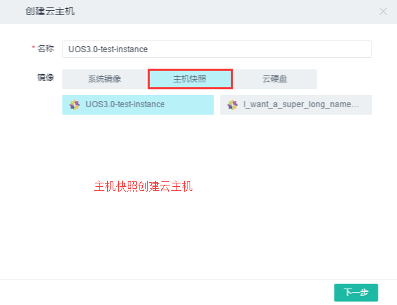

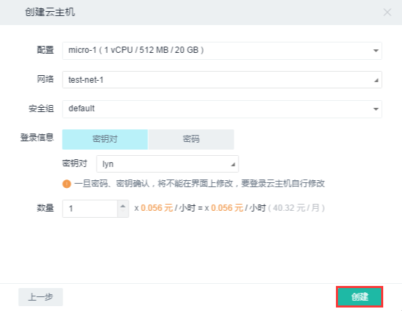

-  **删除主机快照**

单击二级导航栏“主机快照”->选中主机快照名称前的复选框，单击“删除”按钮
->在弹出框中点击“删除”即可。

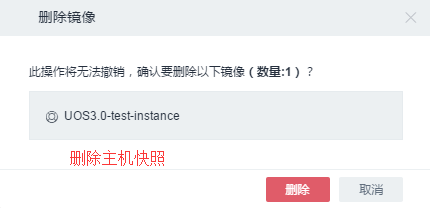

-  **查看主机快照创建的云主机列表**

单击二级导航栏“主机快照”->选中一个主机快照弹出详细信息页->点击“云主机”标签。

3.1.4 密钥对服务
~~~~~~~~~~~~~~~~

1.核心概念
^^^^^^^^^^

**密钥对（Key
Pair）**\ ：主要用于SSH安全登录。公有和私有密钥被称为密钥对。在使用密钥对登录云主机时，在登录时需指定密钥对的名称，然后使用私有密钥连接云主机，即可实现免密码登录。

2.相关操作
^^^^^^^^^^

目前对密钥对的操作支持如下：

-  **创建密钥**

   在创建密钥对时选择“创建密钥”，只需给该密钥命名即可。

   .. figure:: ../../img/Project/Compute/创建密钥.png
      :alt: 

   当创建成功后，系统自动将新创建的密钥对对应的私钥下载到本地，而公钥留在UOS系统中，以便导入云主机。

   -  如果要在Linux/Mac上使用SSH客户端登录远程云主机，则需要设置私钥文件的权限，以确保只有自己保持对文件的读取权限：

   ::

       chmod 400 keypair.pem

   -  如果要在Windows中使用下载到本地的私钥，直接使用是行不通的，需要使用PuTT
      Key
      Generator将下载的.pme格式的文件转换为.ppk格式的文件，如下图示：

   .. figure:: ../../img/Project/Compute/PuTTY格式转换.png
      :alt: 

   接下来便可使用密钥对登录云主机，如下图示：

   .. figure:: ../../img/Project/Compute/PuTTY使用界面.png
      :alt: 

   按照图中的提示，将PuTTY配置完成。\ **注意填写端口号时，由于没有进行端口转发，故要实现SSH登陆，端口号需填为22。当进行端口转发后，则该端口号需填写转发后的端口号。**

   .. figure:: ../../img/Project/Compute/PuTTY密钥对登录.png
      :alt: 

   接下来便进入云主机管理界面，只需填写用户名即可实现快速安全登录。

-  **导入密钥**

   在创建密钥对时选择“导入密钥”，给即将创建的密钥一个名称，并导入公钥即可。

   .. figure:: ../../img/Project/Compute/导入密钥.png
      :alt: 

   **在哪里可以找到该公钥呢？**

   -  **对于Linux/Mac用户**\ ，打开终端，找到“.ssh”文件中的id\_rsa.pub文件，将其内容复制到云平台的“导入公钥”的公钥栏目，即成功的创建了密钥对。通过以下操作便可找到公钥：

   ::

       $ cd ~/.ssh/
       $ ls
       id_rsa  id_rsa.pub  known_hosts
       $ cat id_rsa.pub

   -  **对于Windows用户**\ ，由于本机不存在本地的密钥对，故需要第三方软件生成。本文介绍一款常用的软件PuTTY来实现密钥导入。

   使用PuTTY Key Generator生成一对密钥对，如图示：

   .. figure:: ../../img/Project/Compute/PuTTY生成密钥对.png
      :alt: 

   将上述产生的公钥复制到云平台的“导入公钥”的公钥栏目，即成功的创建了密钥对。

-  **删除密钥**

   单击二级导航栏“密钥对”->选中密钥对名称前的复选框，单击“删除”按钮
   ->在弹出框中点击“删除”即可。

   .. figure:: ../../img/Project/Compute/删除密钥对.png
      :alt: 

   ***备注：*** >
   *由于创建密钥对时公钥已经注入到云平台，故通过云平台删除密钥只是删除了公钥的副本。删除公钥副本并不会影响到原使用该公钥创建的实例的启动，也不对下载到本地的私钥有影响。只是不能再使用该密钥对启动新的实例。*
