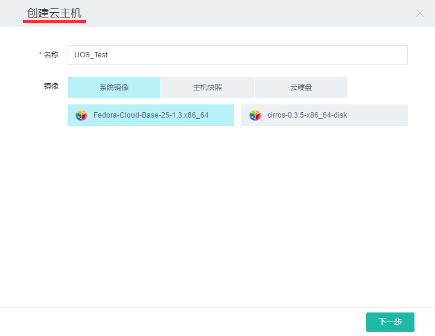
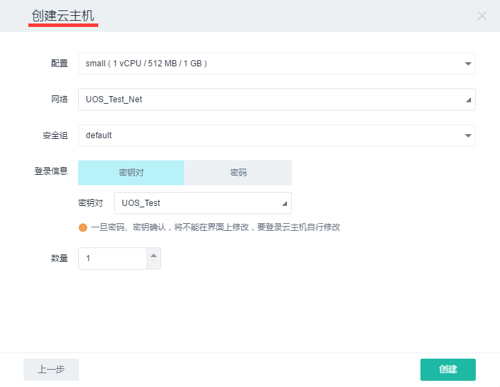
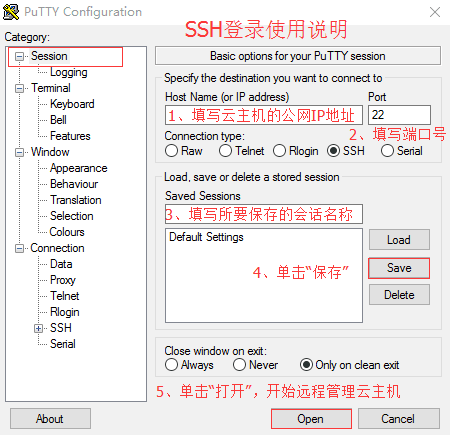
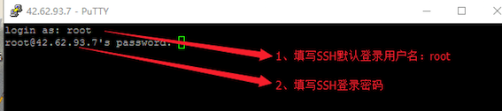

2.2 快速创建云主机
-------------------

2.2.1 快速创建一台云主机
~~~~~~~~~~~~~~~~~~~~~~~~

单击二级导航栏中“云主机”->单击左侧“创建云主机”按钮，在弹出框中给云主机命名并选择系统镜像->单击“下一步”按钮进入下一弹出框。在该弹出框中选择云主机配置信息（即CPU、内存和硬盘容量相关信息）->选择“\ **2.1
组建简单私有网络**\ ”中创建的私有网络->选择默认安全组规则->选择登陆方式（即使用密码输入登录或使用密钥登录）->设置创建云主机的数量->单击“创建”按钮。

至此一台云主机便创建完成。

2.2.2 绑定公网IP到云主机
~~~~~~~~~~~~~~~~~~~~~~~~

由于公网IP是稀有资源，UOS云主机创建完成后并不自动分配公网IP地址，需单独申请。

单击二级导航栏中“公网IP”->单击左侧“申请公网IP”按钮->在弹出框中单击“申请”按钮，即完成公网IP的申请工作。

**选择刚申请的公网IP->单击“绑定到云主机”按钮->在弹出框中选择“”2.2.1
快速创建一台云主机”中创建的云主机->单击“绑定”按钮，该云主机便完成加入网络的工作，即可联网与其它主机进行通信。**

至此，一台可与外界通信的云主机便已创建完成，接下来就是登录该云主机进行管理。UOS云平台提供VNC无网络登陆管理云主机，但是为了更加安全的管理云主机，我们提供一种更安全的登陆方式，即SSH登录。详见如下“\ *2.2.3
SSH登录*\ ”。

2.2.3 SSH登录
~~~~~~~~~~~~~

简单的说，SSH是一种网络协议，用于计算机之间的加密登录。其默认端口是22，即登录请求会送到远程主机的22端口。由于云主机的默认安全组规则中已打开22端口，因此可以直接使用SSH登录。

1.使用密钥对登录

-  **Linux/Mac用户**\ 使用密钥对登录

对于\ **Linux/Mac用户**\ ，在密钥管理处可以直接导入自己的SSH公钥，然后在创建云主机时选择该密钥，这样在登录时无需指定密钥：

``bash   ssh root@{your_public_ip}``

也可以新创建一个密钥对并下载私钥到本地（公钥在UOS系统中保留，以便注入云主机），那么SSH登录时就需要指定该私钥路径：

``bash   ssh -i ~/your_private_key.pem root@{your_public_ip}``

-  **Windows用户**\ 使用密钥对登录

对于\ **Windows用户**\ 而言，想要实现SSH登录，则需要借助第三方软件来实现。本文介绍最常用的一款软件，即PuTTY。

使用PuTTY的Key
Generator生成密钥对，保存私钥在本地，将公钥导入云平台，在创建云主机时选择使用该密钥对，即可使用密钥对登录云主机进行管理。

也可以通过云平台创建密钥对，私钥自动下载到本地。由于下载的密钥格式为.pem，而PuTTY不识别该格式的文件，需要使用PuTTY
Key
Generator将.pem格式的文件转换为PuTTY可识别的.ppk格式，便可使用密钥对登录。

***备注**\ ：* > 如何创建和导入密钥，详见"\ `3.1.4 密钥对服务 <../UOS项目平台/计算服务.rst#314-密钥对服务>`__\ 。"

2.账号密码登录

Linux主机的默认用户名是root，Windows主机的默认用户名是Administrator。登录时使用创建云主机时设置的密码。

-  **Linux/Mac帐号密码登录**

对于\ **Linux/Mac用户**\ ，在终端输入下列命令后，敲回车键，然后输入创建云主机时设置的密码即可实现SSH登录。

``bash   ssh root@{your_public_ip}``

-  **Windows帐号密码登录**

对于\ **Windows用户**\ ，按照下图所示配置PuTTY，即可实现云主机的帐号密码登录。

