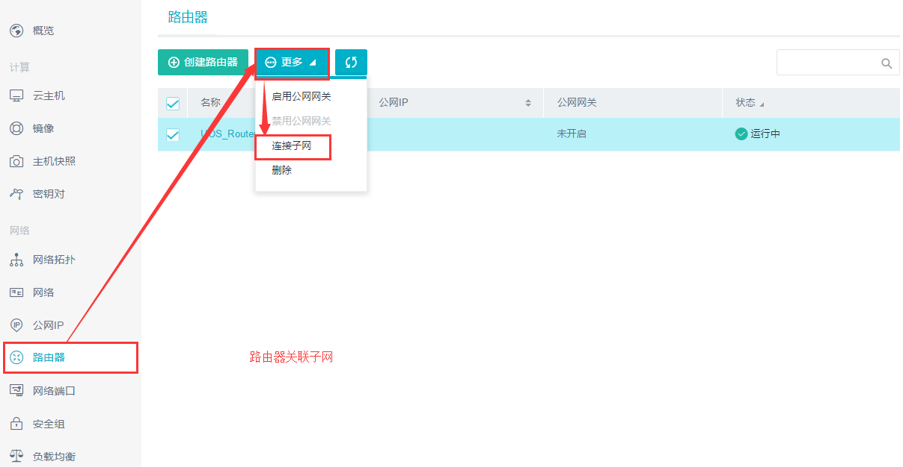

## 2.1 组建简单私有网络
由于UOS控制台不提供基础网络，即在创建云主机之前必须完成简单的网络搭建。如下介绍最简单的网络拓扑构造方法：

1. 单击二级导航栏中“网络”->单击左侧“创建私有网络”按钮，在弹出框中给私有网络命名并选择“开启安全限制”和“创建子网”，并给子网命名，且自行选择子网的CIDR地址->单击“创建”按钮；
2. 单击二级导航栏中“路由器”->单击左侧“创建路由器”按钮，在弹出页面中给路由器命名并选择“开启公网网关”->单击“创建”按钮；
3. 选择刚创建的路由器，点击“更多”按钮，单击“连接子网”，在弹出框中选择刚创建的子网，单击“关联”按钮，如下图示：

至此，一个简单的网络拓扑图已完成，接下来只需在创建云主机时选择加入该网络即可。